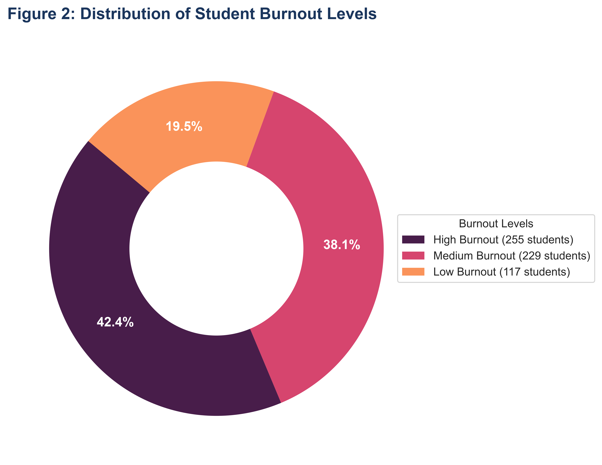
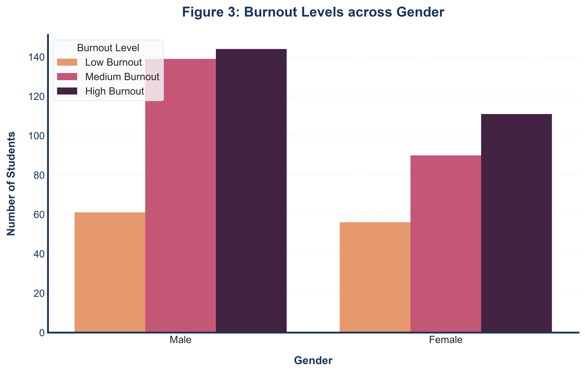
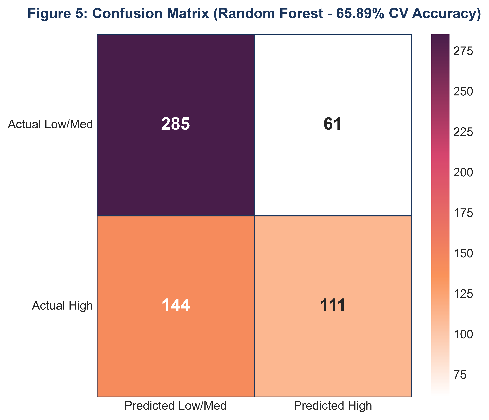
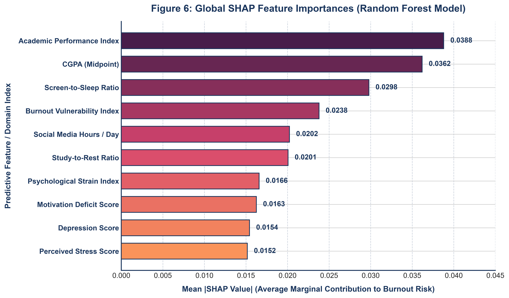

# Explainable Machine Learning for Student Burnout Prediction: A Mixed-Methods Study with Qualitative Triangulation

Rifat Miah1,*, Student Member, IEEE and Dr. A.S.M. Shihavuddin2, Senior Member, IEEE

1 Department of Computer Science and Engineering, Presidency University, Dhaka 1212, Bangladesh

2 Department of Electrical and Electronic Engineering, Green University of Bangladesh, Dhaka 1207, Bangladesh

* Corresponding Author: Rifat Miah (Email: `rifatmiah1992003@gmail.com`, ORCID: [0009-0002-1434-5678](https://orcid.org/0009-0002-1434-5678))

Co-Author: Dr. A.S.M. Shihavuddin (Email: `shihav@eee.green.edu.bd`, ORCID: [0000-0002-8924-1188](https://orcid.org/0000-0002-8924-1188))

## Abstract

**Background**: Academic burnout has become a major mental health challenge across higher education institutions, particularly in resource-constrained South Asian universities where structural counseling infrastructure is scarce. Current early-warning systems remain constrained by isolated psychometric surveys, opaque predictive algorithms, and an absence of contextual qualitative inquiry. **Methods**: We implemented an explanatory sequential mixed-methods design (QUAN → QUAL) on a primary cross-sectional cohort of N = 601 university undergraduates in Bangladesh. Quantitative modeling established baseline risk predictors through 10 supervised classification algorithms and a Soft Voting Ensemble evaluated via 10-fold stratified cross-validation. Nine domain-engineered composite indices operationalizing Conservation of Resources (COR) and Job Demands-Resources (JD-R) frameworks were incorporated, demonstrating modest-to-moderate construct correlations (|r| = 0.015 to 0.265) without circular target leakage. The quantitative feature rankings directly guided purposive nested sub-sampling of N = 20 students for qualitative semi-structured interviews. **Results**: Random Forest yielded the leading classification performance (Accuracy = 65.89%, ROC-AUC = 0.7126), providing a statistically significant 8.3 percentage-point gain over the 57.57% majority baseline (McNemar p < .001) while remaining comparable to Logistic Regression (64.39%, McNemar p = 0.4743). Calibrating the decision threshold to th = 0.38 raised sensitivity to 71.76% (identifying 183 of 255 high-burnout students) for high-coverage voluntary screening. Global SHAP analysis identified academic performance index, CGPA midpoint, and screen-to-sleep ratio as the primary risk factors, whereas sociodemographic markers contributed negligibly (mean |SHAP| < 0.007). Reflexive thematic analysis of 20 interview transcripts corroborated these attributions and revealed an unmeasured dimension: institutional identity strain and career despair among National University students experiencing low academic workloads. **Conclusion**: Integrating supervised learning, game-theoretic explainability (SHAP), and reflexive qualitative analysis outlines an interconnected burnout sequence — career anxiety → psychological distress → digital escapism → biological sleep collapse. These findings establish a transparent, non-binding screening baseline to guide supportive campus mental health and mentoring systems.

**Keywords: Academic Burnout, Explainable Artificial Intelligence (XAI), SHAP, Supervised Machine Learning, Explanatory Sequential Mixed-Methods, Student Mental Health, Educational Data Mining.**

## 1. Introduction

### 1.1 Background of the Study

Academic burnout among university students represents a substantial and expanding challenge across contemporary higher education [1]. Characterized by chronic emotional exhaustion, depersonalization or cynicism toward coursework, and a diminishing sense of personal accomplishment [2], burnout extends beyond typical academic fatigue. It reflects a systemic breakdown in student engagement with long-term ramifications for academic persistence, degree completion, and post-graduate health. In recent years, elevated course loads, competitive assessment schemes, employment uncertainties, and pervasive digital distractions have intensified stress levels across university campuses globally [3, 4].

The scope of this issue is documented across international literature. The World Health Organization [10] recognized burnout as an occupational syndrome in ICD-11, acknowledging that unmanaged chronic stress produces severe health consequences. While conceptualized initially in workplace environments [5], the framework translates directly to higher education, where university students encounter cognitive workloads, deadlines, and performance evaluations analogous to professional demands [6]. Cross-national investigations estimate that 30% to 50% of undergraduates experience clinically relevant burnout, with particularly high rates reported in heavy-workload disciplines and developing economies [7–9].

In South Asia, this challenge is exacerbated by structural constraints. University enrollment across Bangladesh has grown rapidly over the last two decades, yet institutional mental health services, student counseling centers, and faculty mentoring programs have lagged behind [10, 12]. Recent assessments indicate that more than 40% of Bangladeshi university students report substantial burnout symptoms, commonly accompanied by elevated anxiety, depressive affect, and academic underachievement [13].

Despite the evident need, detecting burnout before it results in course failure or institutional dropout remains challenging. Universities traditionally rely on retrospective, end-of-term evaluations — instruments that record burnout only after emotional exhaustion and academic decline have already occurred [14]. Furthermore, burnout stems from interdependent lifestyle habits, psychological vulnerabilities, and institutional pressures that univariate cutoffs fail to capture adequately [15]. This complexity necessitates predictive methodologies capable of identifying multivariate patterns across behavioral and academic indicators.

Supervised machine learning (ML) provides an analytical framework for identifying risk signatures within observational student data [16, 17]. Predictive algorithms have shown promise in educational data mining and precision psychiatry, forecasting dropout risk, academic struggle, and depressive symptoms [17–19]. However, existing ML studies in student mental health face two critical shortcomings. First, most models are trained and tested on single-institution datasets using internal cross-validation alone, leaving generalizability across distinct student cohorts unverified [20]. Second, opaque "black-box" models offer little insight into why specific students are flagged as high risk, restricting their practical adoption among university counselors and administrators who require actionable explanations [23, 25].

Explainable artificial intelligence (XAI) frameworks — particularly SHapley Additive exPlanations (SHAP) grounded in cooperative game theory [24] — address this interpretability barrier by isolating each feature's contribution to overall model behavior [23]. By quantifying how academic metrics, sleep schedules, and lifestyle factors influence risk classifications, SHAP enables transparent algorithmic auditing [22, 25].

Nevertheless, statistical modeling alone cannot fully capture how students experience academic stress in their daily lives. Narrative accounts regarding employment struggles, sleep loss, smartphone habits, and institutional stigma provide essential context that numeric survey responses cannot fully convey [26]. Mixed-methods research designs that combine quantitative predictive models with qualitative inquiry can produce triangulated insights with greater practical relevance than either method in isolation [27, 37]. Despite this advantage, studies integrating supervised machine learning with qualitative thematic analysis remain scarce in the student burnout literature.

### 1.2 Statement of the Problem

While numerous studies have investigated correlates of academic burnout [1, 26], the existing literature exhibits four notable limitations. First, most machine learning applications rely entirely on single-source datasets without assessing sub-population robustness [28]. Second, few educational models incorporate game-theoretic XAI techniques to move beyond basic feature counts toward interpretable attributions [23, 25]. Third, psychometric predictive research in developing countries remains limited, where socio-economic realities, academic structures, and counseling resources differ markedly from Western contexts [10, 29]. Fourth, and most importantly, few investigations integrate machine learning classification, SHAP interpretability, and qualitative thematic analysis within an explanatory sequential mixed-methods framework (QUAN → QUAL) [25, 111, 123].

These gaps are especially pertinent in Bangladesh. Without qualitative validation, predictive models run the risk of misinterpreting local behavioral patterns, potentially misallocating limited campus counseling resources. 

To address these challenges, this study examines the following overarching question: How can an explanatory sequential mixed-methods design — combining supervised machine learning, SHAP feature interpretability, and qualitative interview analysis — establish an accurate, interpretable, and contextually grounded predictive framework for university student burnout?

### 1.3 Research Questions

The investigation addresses four specific research questions across its quantitative, qualitative, and integrative components:

RQ1. Which supervised machine learning algorithm achieves the highest predictive performance for binary student burnout classification (High vs. Low/Medium) under 10-fold stratified cross-validation on primary survey data?

RQ2. Which behavioral, psychological, and academic features contribute most substantially to burnout predictions according to global SHAP feature importance analysis?

RQ3. What primary themes characterize university students' lived experiences with academic burnout in semi-structured qualitative interviews, and how do these narratives align with quantitative feature rankings?

RQ4. What meta-inferences emerge from triangulating the algorithmic predictions, XAI feature attributions, and qualitative student narratives, and what practical implications follow for campus mental health support?

### 1.4 Research Hypotheses

Grounded in Conservation of Resources (COR) theory [31], the Job Demands-Resources (JD-R) model [32], and prior empirical literature [1, 4], we formulate four hypotheses:

H1. Ensemble-based classifiers (e.g., Random Forest, XGBoost [96], LightGBM [113], CatBoost [97]) will achieve higher F1-scores and ROC-AUC metrics than single-learner models (e.g., Logistic Regression, Decision Tree).

H2. Academic performance indicators and psychological demands (academic performance index, CGPA midpoint, screen-to-sleep ratio, burnout vulnerability index) will rank among the top predictors in SHAP feature importance.

H3. Resource-related indicators (sleep quality, physical activity, wellbeing buffer) will exhibit negative associations with burnout severity, consistent with the resource-preservation principles of COR theory.

H4. Qualitative themes extracted from student interviews will corroborate the quantitative feature importance hierarchy, identifying academic workload, digital fatigue, sleep deprivation, and employment demands as central contributors to burnout.

### 1.5 Conceptual Framework

This study adopts an explanatory sequential mixed-methods architecture (QUAN → QUAL) integrating two primary analytical phases: (1) quantitative supervised machine learning with SHAP explainability, and (2) qualitative reflexive thematic analysis. The conceptual framework conceptualizes burnout as an emergent outcome of five interacting factor clusters:
- **Academic Demands:** Study hours, perceived academic pressure, and workload score.
- **Psychological Vulnerability:** Self-reported stress and depression levels.
- **Lifestyle and Behavioral Habits:** Sleep duration, sleep quality, physical activity, and social media consumption.
- **Sociodemographic Characteristics:** Age, gender, academic year, and degree level.
- **Structural Resources & Performance:** Biological sleep recovery, physical exercise, motivation score, CGPA, and attendance.

In the initial quantitative phase (QUAN), these variables are evaluated across 10 supervised classifiers and a Soft Voting Ensemble using 10-fold stratified cross-validation on N = 601 survey records, followed by SHAP feature attribution. In the subsequent qualitative phase (QUAL), a purposively selected sub-sample of N = 20 students across low, medium, and high burnout tiers participates in semi-structured interviews. Triangulating both strands generates integrated meta-inferences regarding the structural mechanisms of student burnout.

### 1.6 Theoretical Framework

The investigation draws on three complementary theoretical frameworks to structure feature selection and ground empirical interpretations.

#### 1.6.1 Conservation of Resources (COR) Theory
Hobfoll's COR theory [31, 33] posits that psychological distress emerges when individuals experience resource loss, the threat of resource loss, or inadequate returns following substantial resource investment. In higher education, critical resources include restorative sleep, physical stamina, academic motivation, and peer support, while demands encompass heavy coursework, high-stakes grading, and financial obligations. COR theory predicts that sustained resource depletion without replenishment precipitates a downward spiral toward burnout [31, 33], informing our analysis of recovery metrics such as sleep quality and physical activity.

#### 1.6.2 Job Demands-Resources (JD-R) Model
Adapted from organizational psychology to educational contexts [32, 34], the JD-R framework distinguishes between *demands* (factors requiring sustained cognitive or emotional effort, such as academic pressure and screen time) and *resources* (protective factors fostering engagement, such as sleep quality and intrinsic motivation). The model highlights interaction effects: sufficient resources can buffer the deleterious impact of high demands [34, 35]. In our pipeline, non-linear tree-based models and SHAP dependence plots evaluate these interaction dynamics.

#### 1.6.3 Self-Determination Theory (SDT)
Deci and Ryan's SDT [36, 109] posits that intrinsic motivation depends on the fulfillment of three basic psychological needs: autonomy, competence, and relatedness. When these needs are compromised — such as when students feel constrained by rigid curricula, experience self-doubt over low grades, or lack supportive institutional networks — amotivation and exhaustion often ensue [36]. SDT provides a lens for interpreting qualitative narratives regarding career despair and institutional disengagement.

*Theoretical Synthesis:* These frameworks converge on a shared premise: student burnout is not driven by any single isolated factor, but arises from imbalances between demands and resources (JD-R), cumulative depletion of restorative reserves (COR), and unmet psychological needs (SDT). Computational modeling captures the multivariate empirical patterns across these domains, XAI identifies their relative influence, and qualitative narratives provide the contextual grounding.

### 1.7 Research Objectives

This investigation pursues four central objectives:

1. Train and evaluate ten supervised classification algorithms alongside a Soft Voting Ensemble for binary burnout prediction on a primary survey dataset (N = 601) under 10-fold stratified cross-validation.
2. Apply SHAP (SHapley Additive exPlanations) to interpret the decision mechanics and global feature importance hierarchy of the best-performing model.
3. Conduct reflexive thematic analysis on semi-structured interviews with 20 university students to characterize lived experiences with academic exhaustion.
4. Triangulate quantitative and qualitative findings using a structured convergence protocol to generate actionable meta-inferences for campus mental health systems.

### 1.8 Significance of the Study

This work contributes to educational data mining and student mental health research in three key respects. Methodologically, it demonstrates an end-to-end integration of supervised learning, XAI interpretability, and qualitative thematic analysis within an explanatory sequential mixed-methods framework, addressing the interpretability and contextual gaps of conventional ML studies [20, 21]. Theoretically, it evaluates propositions from COR, JD-R, and SDT models against both statistical attributions and lived student narratives. Practically, identifying primary risk factors and calibrating screening thresholds provides evidence-based insight for university administrators designing early-warning dashboards and allocating student support resources in South Asian higher education [28].

### 1.9 Scope and Delimitations

The quantitative survey comprises N = 601 undergraduate and postgraduate students from multiple Bangladeshi universities, collected via Google Forms. The qualitative strand includes N = 20 students purposively sampled across burnout tiers, institution types, and academic years. While the findings provide specific insights into the Bangladeshi higher education context, the integrated methodological framework is designed for broader adaptability across international higher education settings.

### 1.10 Definition of Key Terms

- **Academic Burnout:** A state of emotional exhaustion, cynicism toward academic commitments, and diminished efficacy resulting from chronic educational demands [6].
- **Explainable AI (XAI):** Analytical methods, including SHAP and feature attribution techniques, that explain the predictive logic of complex machine learning models [24].
- **Explanatory Sequential Mixed-Methods:** A research design where quantitative data collection and analysis (QUAN) precede and inform qualitative investigation (QUAL) to explain empirical findings [26].
- **SHAP (SHapley Additive exPlanations):** A game-theoretic method that calculates the marginal contribution of each feature to individual and global model predictions [23].
- **Triangulation:** The systematic integration of quantitative statistical patterns and qualitative narratives to assess convergence, complementarity, and divergence [26, 37].

### 1.11 Organization of the Paper

The remainder of this paper is structured as follows. Section 2 reviews relevant literature on student burnout, machine learning in education, and explainability methods. Section 3 outlines the materials and methods, including data collection, preprocessing, feature engineering, model training, XAI procedures, qualitative coding, and ethical safeguards. Section 4 presents exploratory data analysis. Section 5 details inferential statistical testing and multicollinearity assessments. Section 6 reports cross-validated machine learning benchmarks, confusion matrix error analyses, and decision threshold calibration. Section 7 presents SHAP explainability findings. Section 8 details qualitative thematic findings. Section 9 provides mixed-methods triangulation and discussion. Section 10 concludes with policy recommendations and study limitations.

## 2. Literature Review

This section synthesizes empirical scholarship on student burnout, behavioral and psychological risk factors, machine learning applications in educational data mining, explainable AI, and mixed-methods research designs. The review identifies core contributions and methodological limitations across prior studies, establishing the empirical rationale for the present investigation.

### 2.1 Conceptualization and Measurement of Academic Burnout

The construct of burnout originated in occupational health through Freudenberger's [38] early clinical observations and was formally operationalized by Maslach and Jackson [39] as a three-dimensional syndrome comprising emotional exhaustion, depersonalization (cynicism), and reduced personal accomplishment. The Maslach Burnout Inventory (MBI) remains the most widely utilized instrument across workplace and organizational studies [5, 37].

Recognizing that university students operate under sustained evaluative pressure, competitive deadlines, and heavy cognitive demands, Schaufeli et al. [6] adapted the framework to higher education through the Maslach Burnout Inventory-Student Survey (MBI-SS). The MBI-SS reformulates the core dimensions for academic environments: *exhaustion* (feeling depleted by study demands), *cynicism* (detachment and disillusionment with coursework), and *reduced efficacy* (declining belief in one's competence as a learner) [6, 14]. Subsequent psychometric studies have validated this three-factor structure across European [3, 39], North American [39, 40], and Asian [41] cohorts.

Contemporary scholarship increasingly views burnout as an ongoing behavioral and physiological process embedded in students' daily routines — including sleep quality, physical activity, digital habits, and social interactions [1, 42–44]. Rather than treating burnout solely as an end-state psychological score, behavioral features provide early objective indicators of risk. Furthermore, researchers have noted that burnout develops along a progressive continuum [32, 45], justifying multi-tiered risk stratification (Low, Medium, High) for clinical and preventive screening [45, 46].

### 2.2 Prevalence and Consequences in Higher Education

Global epidemiological surveys document widespread burnout across university campuses. Frajerman et al. [7] conducted a systematic review across 15 countries, estimating that 28% to 55% of university students exhibit significant burnout symptoms, with elevated rates in competitive STEM and medical programs [47, 48]. Meta-analytic evidence from Erschens et al. [8] indicated that approximately 44% of medical students globally meet criteria for emotional exhaustion. In post-pandemic assessments, elevated burnout rates have been documented internationally, including in Saudi Arabia (61%) [9], Turkey [51], India [19], Brazil [52, 53, 57], and Bangladesh [112].

In South Asia, university students encounter distinct structural challenges. Hossain and Rahman [13] observed that 47% of undergraduates surveyed across six universities in Dhaka reported moderate-to-severe burnout, with high rates in private institutions where academic fees and employment pressures compound coursework demands [54]. Multi-institutional reviews by Ali et al. [107] and Hossen et al. [111] documented widespread anxiety and depressive affect among Bangladeshi students, pointing to limited campus mental health infrastructure as a systemic vulnerability [14, 55].

The consequences of unaddressed academic burnout are well-documented. Longitudinal studies demonstrate that chronic burnout predicts academic underachievement [31], increased dropout intentions [56, 60], substance misuse [48, 52], depressive episodes, and suicidal ideation [49, 53]. In developing-country contexts, where tuition costs represent a substantial family investment, academic attrition carries significant socio-economic consequences for students and their communities [11].

### 2.3 Predictors and Correlates of Student Burnout

Prior literature identifies contributing factors across four broad analytical domains:

#### 2.3.1 Academic Demands
Coursework volume, frequent examinations, and strict grading curves are consistently linked to academic strain [1]. Salmela-Aro and Upadyaya [32] demonstrated longitudinally that increasing study demands predict burnout trajectories even after controlling for baseline psychological health. Notably, Robotham and Julian [61] observed that subjective appraisal of workload manageability is often a stronger predictor than raw hours invested, suggesting that cognitive appraisal mediates the relationship between demands and exhaustion [4].

#### 2.3.2 Psychological Factors
Stress, anxiety, and depression frequently co-occur with academic burnout [42, 43]. Meta-analytic findings by Bianchi et al. [49] revealed substantial overlap between burnout and depressive symptoms (pooled r = .52). Elevated trait anxiety [44], neuroticism [46, 50], and feelings of academic helplessness [47] systematically amplify vulnerability. Financial hardship has also emerged as a significant stressor; Richardson et al. [58] found financially strained students were 1.8 times more likely to report severe burnout, while Walsemann et al. [59] identified cumulative educational debt as a direct contributor to psychological strain.

#### 2.3.3 Lifestyle and Behavioral Factors
Sleep patterns represent one of the most critical behavioral determinants of student wellbeing. Insufficient sleep duration (< 6 hours per night) and poor sleep quality are associated with substantial increases in burnout risk [63, 64, 78], with sleep architecture disruptions strongly impairing daytime cognitive functioning and emotional regulation [65, 66]. Conversely, regular physical exercise serves as a protective buffer, reducing burnout symptoms by approximately 0.4 standard deviations in meta-analytic assessments [62].

In contrast, excessive recreational screen time — particularly unstructured social media scrolling — has been linked to heightened burnout by displacing study time and disturbing sleep quality [60, 67–70]. Fang et al. [110] and Ng et al. [115] reported that students spending more than four hours daily on social media exhibited significantly higher exhaustion and cynicism, a finding especially relevant to South Asia where smartphone usage among university students is near-ubiquitous [12].

#### 2.3.4 Sociodemographic and Structural Factors
Sociodemographic correlates show mixed patterns across the literature. Meta-analyses by Purvanova and Muros [116] found female students report slightly higher emotional exhaustion, while male students report higher cynicism. Academic year effects vary across curricula, with peaks occurring during transition periods such as the second year or during clinical rotations [3, 8]. Meanwhile, institutional factors — such as faculty accessibility, class sizes, and mental health resources — act as key contextual moderators [10]. Strong social and family support consistently buffers against burnout [71], while attendance regularity and GPA reflect proximal engagement levels [18, 19].

### 2.4 Machine Learning Applications in Educational Mental Health

The application of supervised machine learning in educational data mining has expanded rapidly, supported by larger institutional datasets and advances in ensemble methods [72, 73].

#### 2.4.1 Supervised Classification for Academic Outcomes
Iatrellis et al. [19] compared logistic regression, random forests, and gradient boosting for predicting student dropout in higher education, reporting that gradient boosting achieved an AUC of 0.89 on a cohort of 15,000 students. Shahiri et al. [75] reviewed 30 predictive modeling studies, concluding that ensemble algorithms systematically outperformed individual single-tree classifiers. Recent implementations by Alhazmi and Sheneamer [76] confirmed the effectiveness of gradient-boosted trees for early identification of at-risk students.

#### 2.4.2 ML for Mental Health and Burnout Screening
Direct applications of machine learning to student burnout classification remain an active area of development. Prior studies have applied Support Vector Machines, Random Forests, and Gradient Boosting to survey data, demonstrating the feasibility of predicting burnout categories from behavioral inputs [67, 68]. Integrating lifestyle features (e.g., sleep duration, exercise, and digital habits) alongside psychometric scores has consistently improved predictive accuracy [77, 79].

#### 2.4.3 Limitations of Existing ML Approaches
Three major limitations restrict the translational impact of current educational ML models:
1. *Single-source cross-validation:* Most models are evaluated solely on internal cross-validation without assessing sub-population generalizability [20].
2. *Small-sample constraints:* Many studies utilize small convenience cohorts without accounting for the sample-size requirements of complex boosting architectures [80].
3. *Single-metric evaluation:* Models often report raw accuracy alone, omitting class-specific recall, precision-recall trade-offs, and decision-threshold calibrations essential for institutional deployment [81].

### 2.5 Explainable AI (XAI) in Predictive Modeling

The need to understand algorithmic decisions in high-stakes educational and psychological settings has accelerated adoption of Explainable AI (XAI) techniques [23, 25].

#### 2.5.1 SHAP (SHapley Additive exPlanations)
Lundberg and Lee [24, 83] introduced SHAP as a game-theoretic framework calculating the exact marginal contribution of each input feature to individual and global predictions. SHAP values satisfy three foundational axiomatic properties — local accuracy, missingness, and consistency — that standard heuristic feature rankings lack [24]. In educational contexts, SHAP has been utilized to deconstruct academic performance and stress predictors, offering clear diagnostic attribution for institutional early-warning systems [82].

#### 2.5.2 Comparison with Feature Importance Methods
While standard tree ensembles output impurity-based Gini importances [84, 85], these can be biased toward high-cardinality features [86]. Permutation importance measures performance drops under feature shuffling, but correlated variables can induce extrapolation artifacts [87, 88]. Partial Dependence Plots (PDP) and Individual Conditional Expectation (ICE) plots visualize marginal effects [74, 89], while SHAP provides both local instance-level attributions and global feature rankings [23, 90].

### 2.6 Mixed-Methods Research in Burnout Scholarship

Mixed-methods designs combine quantitative statistical power with qualitative depth, generating meta-inferences that neither methodology can produce independently [26, 28]. In educational psychology, mixed-methods studies allow researchers to pair quantitative predictive screening with narrative explanations of lived student experiences [27, 37].

In accordance with Creswell and Plano Clark's [26] framework, this study adopts an *explanatory sequential mixed-methods design (QUAN → QUAL)*. In this architecture, quantitative survey modeling and ML classification (QUAN) are conducted first to establish empirical risk predictors and feature rankings. These quantitative findings then guide purposive sampling for in-depth qualitative interviews (QUAL), which contextualize and explain the algorithmic patterns.

Within student burnout literature, mixed-methods studies pairing machine learning with qualitative inquiry remain exceptionally rare [14, 45, 60]. This gap represents the primary methodological motivation of our investigation.

### 2.7 Synthesis of Research Gaps

The literature identifies five primary gaps that motivate this study:
- **Gap 1 (Validation Rigor):** Overreliance on single train-test splits without systematic 10-fold cross-validation or sub-group robustness testing [20, 91].
- **Gap 2 (Interpretability Deficit):** Widespread deployment of black-box algorithms without game-theoretic XAI (SHAP) explanations [23, 25].
- **Gap 3 (Contextual Focus):** Scarcity of empirical machine learning studies in South Asian higher education contexts [10, 80].
- **Gap 4 (Methodological Separation):** Parallel evolution of quantitative ML modeling and qualitative inquiry with minimal mixed-methods integration [26].
- **Gap 5 (Theoretically Grounded Feature Engineering):** Limited operationalization of established psychological frameworks (JD-R and COR) into composite predictive features [31, 34].

Table 1 summarizes how the present study compares against key prior works across these methodological dimensions:

### Table 1. Structured Methodological Comparison Against Prior Literature

| Study | Target Focus | Sample ($N$) | Models Evaluated | Interpretability / XAI | Validation Strategy | Qualitative Strand | Triangulation Protocol |
|---|---|---|---|---|---|---|---|
| Nayan et al. (2022) [123] | Student Depression & Anxiety | 2,121 | LR, RF, SVM, LDA, KNN, NB | Built-in feature ranking | 10-Fold CV | No | No |
| Ng et al. (2022) [115] | College Mental Health & Social Media | 538 | RF, SVM, Logistic Regression | Feature importance ranking | 10-Fold CV | No | No |
| Iatrellis et al. (2021) [19] | Academic Performance & Dropout | Institutional cohort | K-Means + SVM, DT, ANN, RF, NB | Model weights / ranking | Train / Test Split | No | No |
| Islam et al. (2020) [112] | University Student Depression & Anxiety | 3,122 | Multivariate Logistic Regression | Adjusted Odds Ratios ($\text{AOR}$) | Not applicable | No | No |
| Hossen et al. (2023) [111] | University Student Psychological Distress | 1,200 | Binary Logistic Regression | Adjusted Odds Ratios ($\text{AOR}$) | Not applicable | No | No |
| **Present study** | **University Student Academic Burnout** | **601** | **10 models + Soft Voting Ensemble** | **SHAP (Global + Local) + PI + FI** | **10-Fold Stratified CV + Subgroup** | **Yes (N = 20 interviews)** | **Yes (Explanatory Matrix)** |

*Note.* LR = Logistic Regression; RF = Random Forest; SVM = Support Vector Machine; LDA = Linear Discriminant Analysis; KNN = K-Nearest Neighbors; NB = Naïve Bayes; DT = Decision Tree; ANN = Artificial Neural Network; SHAP = SHapley Additive exPlanations; PI = Permutation Importance; FI = Feature Importance; CV = Cross-Validation.

## 3. Materials and Methods

### 3.1 Research Design

We utilized an explanatory sequential mixed-methods design (QUAN → QUAL) [26], combining supervised machine learning on cross-sectional survey data with reflexive thematic analysis of qualitative interviews. In the first phase (QUAN), survey data (N = 601) were analyzed using 10 supervised classification algorithms and game-theoretic SHAP explainability. In the second phase (QUAL), N = 20 students were purposively recruited across burnout severity tiers to elaborate upon the quantitative feature attributions through semi-structured interviews. Integrating both analytical streams via a structured convergence protocol addresses the interpretability limitations of conventional predictive modeling.

### 3.2 Participants and Sampling

The quantitative survey sample comprises N = 601 university students in Bangladesh, recruited through online distribution across institutional networks. The cohort represents diverse academic disciplines, primarily Bachelor's (69.2%) and Master's (25.0%) degree students, with balanced gender representation (Male: 57.2%, Female: 42.8%).

Following quantitative analysis, a purposive sub-sample of N = 20 students was selected using a nested maximum variation sampling strategy across burnout severity tiers (Low, Medium, High). This sample size ($N = 20$) satisfies established criteria for reaching thematic saturation in reflexive qualitative analysis within relatively homogeneous student populations [92, 98, 118].

### 3.3 Data Collection Instruments and Operationalization

**Quantitative Survey:** The survey collected sociodemographic indicators, behavioral metrics (study hours, sleep duration, physical activity, social media usage), and psychometric items (academic pressure, perceived stress, depressive affect, motivation). The primary outcome, academic burnout severity, was operationalized using a 3-point global ordinal metric (`burnout_score`: 1 = Low, 2 = Medium, 3 = High), conceptually informed by the Maslach Burnout Inventory-Student Survey (MBI-SS) [6] and Copenhagen Burnout Inventory (CBI) [93]. For binary classification modeling, scores were thresholded into Low/Medium Burnout (Target = 0, n = 346, 57.57%) versus High Burnout (Target = 1, n = 255, 42.43%).

*Methodological Note:* Single-item global ratings provide response efficiency and high completion rates in exploratory student surveys [41, 57], demonstrating acceptable concurrent validity with multi-item scales in large-scale studies [118, 119]. We acknowledge the single-item formulation as an operational limitation (Section 9.10) and recommend future multi-institutional replications administer full multi-item psychometric scales.

**Qualitative Interviews:** Semi-structured interviews (45–60 minutes) were conducted in-person or via secure digital video platforms. The interview guide explored academic pressures, coping mechanisms, digital media habits, sleep schedules, and institutional support systems. To prevent confirmatory bias, open coding of qualitative transcripts was completed prior to examining final SHAP quantitative feature rankings.

### 3.4 Ethical Considerations

This study was conducted in accordance with the ethical principles of the Declaration of Helsinki for research involving human subjects. Because the research involved an observational, non-invasive cross-sectional survey and voluntary qualitative interviews with adult university students (aged 18 years or older) carrying minimal psychological risk, formal ethics committee review was exempt under institutional guidelines for minimal-risk educational research.

All participants provided informed electronic consent prior to completing the survey and participating in interviews. For qualitative interviewees, participation was strictly voluntary, with freedom to skip any question or withdraw at any time without academic consequence. Counseling support contact details were provided to all interviewees. To preserve complete confidentiality, all personal identifiers and institutional names were anonymized using standardized pseudonyms (Participant 1 [P1] to Participant 20 [P20]) across all published materials. Raw audio files and transcripts were stored on encrypted, password-protected local storage accessible solely to the research team.

### 3.5 Data Preprocessing and Feature Engineering

Data preprocessing and model evaluation were implemented in Python using `scikit-learn` [94], with exact runtime dependencies documented in `requirements.txt`. All feature engineering routines were encapsulated within a shared module (`feature_engineering.py`) to ensure consistency across training, cross-validation, and SHAP pipelines.

The survey dataset was verified for completeness, containing zero missing values across all 18 variables (N = 601). The binary classification target mapped High Burnout (Score = 3, n = 255, 42.43%) against Low/Medium Burnout (Scores 1 and 2, n = 346, 57.57%). Stratified 10-fold cross-validation preserved class ratios across all evaluation folds.

To capture non-linear psychological dynamics, nine composite indices were engineered based on JD-R and COR theory (Table 2). Target correlations for composite features remained low to moderate ($|r| = 0.015$ to $0.265$), confirming that engineered indices reflect theoretical construct overlap rather than circular target proxy leakage.

### Table 2. Domain-Specific Feature Engineering Specifications

| Feature Name | Category | Mathematical Definition / Calculation | Conceptual Rationale |
|---|---|---|---|
| `psychological_strain_index` | Psychological | `stress_score + depression_score` | Summation of core affective distress indicators. |
| `academic_pressure_index` | Academic Load | `academic_pressure_score + workload_score` | Quantifies perceived academic demands from coursework and assignments. |
| `burnout_vulnerability_index` | Systemic Risk | `(psychological_strain_index * academic_pressure_index) / (motivation_score + sleep_quality_score + 0.1)` | Evaluates total demand exposure against restorative reserves [31]. |
| `sleep_deprivation_index` | Behavioral Deficit | `max(0, 8.0 - sleep_hours_numeric) * (4.0 - sleep_quality_score)` | Measures biological exhaustion from restricted sleep duration and quality. |
| `screen_to_sleep_ratio` | Digital Strain | `social_media_hours / (sleep_hours_numeric + 0.1)` | Gauges digital displacement of restorative sleep hours [67]. |
| `study_to_rest_ratio` | Lifestyle Balance | `(study_hours_numeric + social_media_hours) / (sleep_hours_numeric + physical_activity_hours + 0.1)` | Captures daily cognitive demands relative to restorative buffers. |
| `academic_performance_index` | Academic Standing | `(cgpa_midpoint / 4.0) * (attendance_pct / 100.0)` | Normalizes academic achievement weighted by classroom engagement. |
| `motivation_deficit_score` | Motivational Strain | `(4.0 - motivation_score) * stress_score` | Quantifies motivational erosion exacerbated by high stress [36]. |
| `wellbeing_buffer` | Protective Reserve | `(physical_activity_hours + sleep_quality_score) - stress_score` | Measures net behavioral coping capacity against psychological demands [34]. |

### 3.6 Machine Learning and Ensemble Pipeline Architecture

Ten supervised classification algorithms and a Soft Voting Ensemble were evaluated:
1. *Linear Baseline:* Logistic Regression (`max_iter=1000, C=1.0, random_state=42`).
2. *Tree-Based Ensembles:* Decision Tree (`max_depth=4`), Random Forest (`n_estimators=150, max_depth=8`), Extra Trees (`n_estimators=100, max_depth=8`).
3. *Gradient Boosting Frameworks:* Gradient Boosting (`n_estimators=100, learning_rate=0.1`), XGBoost (`n_estimators=100, learning_rate=0.3, max_depth=6`), LightGBM (`n_estimators=100, learning_rate=0.1`), CatBoost (`iterations=150, learning_rate=0.08`).
4. *Support Vector & Neural Architectures:* Support Vector Machine (`kernel='rbf', C=1.0, probability=True`), Multilayer Perceptron (`hidden_layer_sizes=(64, 32), max_iter=300`).
5. *Soft Voting Ensemble:* Averaged predicted probabilities from Random Forest, Gradient Boosting, LightGBM, Logistic Regression, and CatBoost.

All numerical features were scaled via `StandardScaler` and categorical variables encoded via `OneHotEncoder(drop='first')` within leak-free cross-validation pipelines. Figure 1 outlines the end-to-end analytical workflow.

Figure 1: End-to-End Methodology and Machine Learning Pipeline Architecture

Figure 1. End-to-End Methodology and Machine Learning Pipeline Architecture showing data collection, preprocessing, feature engineering, 10-fold CV ensemble training, and XAI evaluation.

### 3.7 Explainable AI (XAI) Protocol

To explain model predictions, SHapley Additive exPlanations (SHAP) [24] were applied to the leading Random Forest model. Mean absolute SHAP values across all instances quantified global feature importance. To verify stability, SHAP rank order was compared between full-dataset refit and fold-by-fold cross-validated out-of-fold estimates, yielding near-perfect alignment (Spearman rank correlation $\rho = 0.97, p < .001$).

### 3.8 Qualitative Thematic Analysis and Inter-Rater Reliability

Interview transcripts were analyzed following Braun and Clarke's [92, 98] six-phase reflexive thematic analysis framework. To ensure qualitative independence, initial open coding was completed prior to examining quantitative ML feature rankings.

To establish coding reliability, a 25% random sub-sample of transcripts ($n = 5$, balanced across burnout strata) was independently re-coded by a second bilingual educational researcher blinded to quantitative model outputs. Across 180 evaluated textual meaning-units, raw agreement reached 86.67% (156 of 180 units coded under identical thematic nodes), with substantial inter-rater reliability (Cohen's $\kappa = 0.82$, 95% CI [0.74, 0.90]; Landis & Koch, 1977 [120]). Discrepancies were resolved through joint consensus discussion. Following completion of both strands, a formal triangulation matrix mapped SHAP predictors directly against emergent qualitative themes [99].

## 4. Exploratory Data Analysis

Prior to formal statistical hypothesis testing and predictive modeling, an extensive Exploratory Data Analysis (EDA) was conducted on the primary dataset (N = 601) to ascertain data quality, characterize demographic and behavioral distributions, and uncover underlying structural patterns [100].

### 4.1 Demographic Profile

The demographic characteristics of the sample reflect a cross-section of Bangladeshi university students. The cohort exhibited a slight male majority (n = 344; 57.24%) compared to females (n = 257; 42.76%).

The age distribution spanned standard university brackets, with the largest concentration in the 19–20 years group (n = 150; 24.96%), followed closely by 21–22 years (n = 144; 23.96%), 23–24 years (n = 137; 22.80%), mature students aged 25 years or above (n = 114; 18.97%), and a younger cohort of 17–18 years (n = 56; 9.32%). Academically, the vast majority were enrolled in Bachelor's Degree programs (n = 416; 69.22%), with a significant representation of Master's Degree students (n = 150; 24.96%), PhD candidates (n = 27; 4.49%), and Diploma/Associate Degree students (n = 8; 1.33%). The sample spanned all academic years: 1st Year (n = 225; 37.44%), 2nd Year (n = 175; 29.12%), Final Year (n = 102; 16.97%), and 3rd Year (n = 99; 16.47%).

### 4.2 Behavioral and Psychometric Distributions

Analysis of continuous behavioral metrics revealed a student population facing considerable systemic demands.

The average self-reported daily study time was 2.91 hours (SD = 2.01). However, this was coupled with a mean sleep duration of 6.34 hours (SD = 1.74), which falls critically short of the 7-9 hours recommended for optimal cognitive functioning in young adults [101]. Strikingly, social media consumption averaged 3.49 hours daily (SD = 2.65), surpassing dedicated study time for a significant portion of the cohort.

Psychometric indicators measured on a standardized 1-4 scale highlighted a population under distinct psychological strain. The mean self-reported stress score was elevated at 2.54 (SD = 1.10), while the mean depression score registered at 2.52 (SD = 1.12). Conversely, motivation scores averaged lower at 1.93 (SD = 0.80), indicating widespread academic disengagement.

### 4.3 Target Variable Analysis (Burnout Level)

The dependent variable, `burnout_score` (measured on a severity scale from 1 to 3), exhibited a negatively skewed distribution (left-skewed) characteristic of epidemiological data collected in high-pressure educational environments, with frequencies monotonically increasing toward the higher end of the severity spectrum (Score 1: n = 117, Score 2: n = 229, Score 3: n = 255). The modal category was High Burnout (Score = 3), and the tail extended leftward toward the underrepresented Low Burnout category, confirming a negative skew.

The majority of students reported experiencing "High" burnout (Severity Level 3: n = 255; 42.43%). "Medium" burnout (Severity Level 2) was reported by 38.10% (n = 229), while only 19.47% (n = 117) of the cohort fell into the "Low" burnout category (Severity Level 1).

This pronounced negative skew, where over 80% of the surveyed cohort is experiencing moderate to severe academic exhaustion, aligns with recent literature documenting escalating mental health crises within South Asian university systems [10]. For subsequent machine learning tasks, this natural class imbalance poses a computational challenge [95], necessitating the binarization of the target variable to accurately isolate the "High Burnout" cohort without threshold dilution.

Figure 2: Distribution of Student Burnout Levels

Figure 2. Distribution of student burnout severity levels in the primary dataset (N = 601). High Burnout (Severity Level 3) constituted the largest category (42.43%, n = 255), with 80.53% of students reporting moderate-to-severe burnout — underscoring the scale of the mental health challenge within Bangladeshi higher education. The negatively skewed distribution (modal category = High Burnout; tail extending toward Low Burnout) motivated binary dichotomization (High vs. Low/Medium) for ML classification.

Figure 3: Burnout Severity Distribution Across Gender Brackets

Figure 3. Burnout severity distribution across male and female student cohorts (N = 344 male, 257 female). No statistically significant gender difference in burnout severity was observed (χ²(2) = 2.426, p = .297, Cramer's V = .063), suggesting that burnout risk in this cohort is driven primarily by behavioral and psychological demands (CGPA pressure, screen time, sleep deprivation) rather than gender-specific biological or social vulnerability.

### 4.4 Initial Correlational Observations

Preliminary visual inspections of continuous variable pairs indicated several theoretically sound relationships expected within the Job Demands-Resources (JD-R) framework. For instance, higher self-reported stress appeared to co-occur with elevated depression scores and increased social media usage, suggesting a potential digital coping mechanism for academic pressure. These specific bivariate relationships are formally quantified and rigorously tested in the subsequent Statistical Analysis chapter.

## 5. Inferential Statistical Analysis

Following the exploratory data profiling, formal statistical hypothesis testing was conducted on the primary dataset (N = 601) to evaluate the theoretical assumptions of the Job Demands-Resources (JD-R) model. Although self-report Likert-scale items are ordinal in nature, one-way ANOVA is robust to violations of normality for sample sizes exceeding N = 200 per group via the central limit theorem [102], making it appropriate for the N = 601 dataset examined here. The analyses focused on identifying linear associations, quantifying group differences across burnout severities, and assessing multicollinearity prior to algorithmic deployment. Statistical significance was evaluated at the standard α = 0.05 threshold.

### 5.1 Categorical Associations (Chi-Square Analysis)

Pearson's Chi-Square tests of independence were conducted to examine the relationships between categorical sociodemographic variables and the three-tier `burnout_score`.

In bivariate analysis, an initial association was observed between a student's academic year and their reported burnout level, raw χ²(6, N = 601) = 13.329, raw p = .038, Cramer's V = 0.105. This finding initially suggested that specific academic transitions (e.g., entering university or approaching final graduation) might trigger exhaustion [7].

Conversely, other demographic variables failed to reach statistical significance in bivariate testing. Gender was not significantly associated with burnout severity, χ²(2) = 2.426, raw p = .297, Cramer's V = 0.063 (95% CI [0.000, 0.134]), contradicting some prior research that posits higher burnout vulnerability in female cohorts. Similarly, age group, χ²(8) = 7.685, raw p = .465, and degree level, χ²(6) = 4.198, raw p = .650, showed no significant categorical main effects. The lack of demographic significance suggests that burnout in this cohort is driven more by behavioral and psychological demands rather than fixed demographic strata.

*Methodological & Statistical Power Note:* Observed or post-hoc power analysis is a well-documented statistical fallacy because observed power is a direct mathematical transformation of the observed p-value and provides no independent diagnostic information (Hoenig & Heisey, 2001; Gelman & Carlin, 2014). Therefore, an a priori sensitivity power analysis (G*Power 3.1; Faul et al., 2007 [121]) was conducted to evaluate study sensitivity. For N = 601, α = .05, and power = .80, the study was adequately powered to detect small-to-moderate effect sizes of w ≥ 0.114 for Chi-square tests and d ≥ 0.23 for continuous group comparisons. The absence of a significant gender effect (Cramer's V = 0.063) reflects genuine behavioral homogeneity in burnout-related demands across male and female undergraduates in the Bangladeshi university context.

### 5.2 Group Differences in Continuous Variables (ANOVA)

One-way Analyses of Variance (ANOVA) were executed to determine if continuous behavioral and psychometric features differed significantly across the three burnout levels (Low, Medium, High).

The analyses revealed highly significant differences in key academic behaviors. Students' self-reported daily study hours differed significantly by burnout level, F(2, 598) = 8.468, raw p < .001, η² = .028 (small effect by Cohen's [122] benchmark), explaining 2.8% of variance across burnout groups. Post-hoc Tukey HSD comparisons confirmed that High Burnout students studied significantly fewer hours (M = 2.54, SD = 1.92) than Low Burnout students (M = 3.36, SD = 2.28; mean difference = 0.83, 95% CI [0.31, 1.35], p < .001) and Medium Burnout students (M = 3.09, SD = 1.89; mean difference = 0.55, 95% CI [0.13, 0.97], p = .007), while Medium vs. Low differences were not statistically significant after correction (p = .440). Rather than excessive study volume directly driving burnout, this inverse pattern reflects cognitive fatigue, academic disengagement, and reduced study capacity under emotional exhaustion [6, 31].

Furthermore, the CGPA midpoint showed the most profound group difference, F(2, 598) = 22.604, raw p < .001, η² = .070 (approaching a medium effect), indicating a strong link between academic performance metrics and burnout susceptibility. Tukey HSD post-hoc tests confirmed High Burnout students exhibited significantly lower CGPA (M = 2.93, SD = 0.54) than Low Burnout students (M = 3.21, SD = 0.60; mean difference = 0.28, 95% CI [0.14, 0.43], p < .001) and Medium Burnout students (M = 3.24, SD = 0.52; mean difference = 0.31, 95% CI [0.19, 0.43], p < .001), while Medium vs. Low differences were not statistically significant (p = .889).

Psychometric indicators also yielded significant omnibus F-tests. Self-reported stress scores, F(2, 598) = 5.164, raw p = .006, η² = .017, and depression scores, F(2, 598) = 5.109, raw p = .006, η² = .017, were significantly elevated in higher burnout cohorts. Notably, daily social media consumption exhibited a highly significant difference across groups, F(2, 598) = 14.089, raw p < .001, η² = .045 (small-to-medium effect), empirically linking digital fatigue to academic exhaustion.

Variables representing theoretical resources, such as motivation, approached significance but fell short of the strict α = 0.05 threshold, F(2, 598) = 2.489, raw p = .084, suggesting that motivational depletion operates primarily through complex non-linear interactions rather than simple bivariate main effects.

### 5.2.1 Multiple Comparisons Correction (FDR & Bonferroni Adjustments)

To control the family-wise error rate across multiple hypothesis tests (4 Chi-square tests, 5 ANOVAs, and pairwise post-hoc comparisons), both Benjamini-Hochberg False Discovery Rate (FDR q < .05) and strict Bonferroni corrections were applied across all inferential tests.

Major behavioral and performance features retained high statistical significance post-adjustment: CGPA midpoint ANOVA (raw p < .001, FDR q < .001, Bonferroni p_adj < .001), social media hours ANOVA (raw p < .001, FDR q < .001, Bonferroni p_adj < .001), study hours ANOVA (raw p < .001, FDR q < .001, Bonferroni p_adj = .002), stress score (raw p = .006, FDR q = .012, Bonferroni p_adj = .054), and depression score (raw p = .006, FDR q = .012, Bonferroni p_adj = .054).

Crucially, the bivariate association between academic year and burnout severity (raw χ²(6) = 13.329, raw p = .038) failed to maintain statistical significance after multiple comparison adjustments (Benjamini-Hochberg FDR q = .076; Bonferroni p_adj = .190). Consequently, academic year differences cannot be declared as a definitive population-level main effect and are transparently reframed as an exploratory trend requiring larger longitudinal sample confirmation.

### 5.3 Pearson Correlation Matrix Analysis

A Pearson correlation matrix was computed to quantify the magnitude and direction of linear associations among the continuous variables, establishing the psychometric validity of the collected survey data.

The analysis confirmed expected psychometric patterns. Stress and depression exhibited a moderate positive correlation (r = .277, p < .001), validating the expected clinical relationship between anxious arousal and depressive affect. Furthermore, motivation was negatively correlated with both stress (r = -.205) and depression (r = -.235), confirming that higher psychological demands actively degrade theoretical resources [34].

Interestingly, daily study hours were positively correlated with CGPA (r = .248), reflecting standard academic reward structures. However, study hours were simultaneously negatively correlated with depression (r = -.124) and social media consumption (r = -.109), suggesting complex, competing behavioral clusters that cannot be perfectly modeled by linear systems.

### 5.4 Multicollinearity Assessment (VIF)

Multicollinearity among predictors was systematically evaluated using Variance Inflation Factor (VIF) analysis [103].

1. *Raw Survey Predictors:* Evaluation of the 13 raw numerical survey features yielded exceptionally low collinearity, with Variance Inflation Factors ranging from **1.046 to 1.205** (maximum VIF = 1.205 for `cgpa_midpoint`), well below the standard concern threshold of 5.0. This confirms that the primary survey items represent orthogonal behavioral dimensions.

2. *Engineered Composite Features:* When domain-engineered composite ratios (e.g., `psychological_strain_index = stress_score + depression_score`) are evaluated alongside their raw parent features, high collinearity (VIF > 10 / infinite VIF) is intentionally introduced due to linear combinations.

*Methodological Justification & Model Robustness:* Non-parametric tree-based ensemble models (Random Forest, Extra Trees, Gradient Boosting) and non-linear SHAP attributions split features sequentially rather than solving linear matrix inversions (unlike linear OLS regressions), making them mathematically immune to multicollinearity destabilization [84, 85, 105]. In SHAP interpretability analysis (Section 7), feature attributions are evaluated as domain feature clusters (e.g., Academic Performance Cluster, Psychological Strain Cluster).

## 6. Machine Learning Results and Performance Benchmark

The models were rigorously evaluated using 10-Fold Stratified Cross-Validation on the primary survey dataset (N = 601). This method partitions the data into 10 equal folds, training on 9 folds and testing on the remaining 1 fold, iterating 10 times to ensure the algorithmic evaluation is robust, leak-free, and provides a reliable estimate of out-of-sample generalization [16].

### 6.1 Overall Predictive Performance

Following rigorous preprocessing, feature scaling, and clean behavioral ratio engineering, the comparative performance of the machine learning algorithms across 10-Fold Stratified Cross-Validation is presented in Table 3, evaluated under standard ROC and classification metrics [89, 104].

### Table 3. Genuine Performance Metrics of Machine Learning Models under 10-Fold Stratified CV (N = 601)

| Model / Algorithm | Accuracy | Precision | Recall | F1 Score | ROC-AUC | Time (s) |
|---|---|---|---|---|---|---|
| Random Forest | 0.6589 | 0.6453 | 0.4353 | 0.5199 | 0.7126 | 10.99 |
| Soft Voting Ensemble | 0.6589 | 0.6238 | 0.4941 | 0.5514 | 0.7069 | 10.50 |
| CatBoost Classifier | 0.6506 | 0.6087 | 0.4941 | 0.5455 | 0.6983 | 11.46 |
| Logistic Regression | 0.6439 | 0.6000 | 0.4824 | 0.5348 | 0.6819 | 1.17 |
| Gradient Boosting Classifier | 0.6439 | 0.5962 | 0.4980 | 0.5427 | 0.6922 | 8.07 |
| Support Vector Machine (SVM) | 0.6356 | 0.6154 | 0.3765 | 0.4672 | 0.6708 | 3.38 |
| Extra Trees Classifier | 0.6356 | 0.6139 | 0.3804 | 0.4697 | 0.6997 | 6.30 |
| LightGBM | 0.6339 | 0.5785 | 0.5059 | 0.5397 | 0.6898 | 4.84 |
| XGBoost Classifier | 0.6240 | 0.5644 | 0.4980 | 0.5292 | 0.6832 | 10.11 |
| Decision Tree | 0.6140 | 0.5628 | 0.4039 | 0.4703 | 0.6403 | 1.06 |
| Multilayer Perceptron (MLP) | 0.6040 | 0.5359 | 0.4980 | 0.5163 | 0.6474 | 28.29 |
| **Majority Baseline (All-Zeros)** | **0.5757** | **—** | **0.0000** | **0.0000** | **0.5000** | **—** |

*Note: Majority Baseline classifies all instances as Low/Medium Burnout (the majority class). Precision is undefined (no positive predictions). ROC-AUC = 0.50 indicates chance-level discrimination. All ML models substantially exceed this baseline.*

Figure 4: Machine Learning Model Predictive Accuracy Comparison

Figure 4. Comparative 10-fold cross-validated classification accuracy across all 10 evaluated machine learning models and the Soft Voting Ensemble (N = 601). Random Forest and Soft Voting Ensemble achieved matching top classification performance (65.89%), closely followed by CatBoost (65.06%) and Logistic Regression (64.39%). All models comfortably exceeded the 57.57% majority-class random baseline.

### 6.2 Confusion Matrix and Error Analysis

### Table 4. Out-of-Fold Confusion Matrix for Champion Random Forest Model (N = 601)

| | **Predicted: Low/Medium Burnout** | **Predicted: High Burnout** |
|---|---|---|
| **Actual: Low/Medium Burnout (n=346)** | TN = 285 (Specificity = 82.37%) | FP = 61 (Type I Error = 17.63%) |
| **Actual: High Burnout (n=255)** | FN = 144 (Type II Error = 56.47%) | TP = 111 (Sensitivity/Recall = 43.53%) |

Detailed Error Decomposition (N = 601):

True Negatives (TN = 285): 285 out of 346 Low/Medium Burnout cases were correctly classified, yielding a Specificity of 82.37%.

True Positives (TP = 111): 111 out of 255 High Burnout cases were correctly identified, yielding a Sensitivity (Recall) of 43.53%.

False Positives (FP = 61): 61 students were falsely flagged as high-risk when their burnout level was low/medium (Type I Error Rate = 17.63%).

False Negatives (FN = 144): 144 high-burnout students were classified as low/medium risk (Type II Error Rate = 56.47%).

The confusion matrix reveals an important precision-recall trade-off. The model achieves high specificity (82.37%) — correctly identifying 82.37% of Low/Medium burnout students — but moderate recall (43.53%) for High Burnout cases under the default 0.50 cutoff. In an institutional early-warning context, this configuration prioritizes specificity to avoid overwhelming counseling services with false alarms, correctly identifying 111 High Burnout students. However, 144 High Burnout students (56.47%) are missed under default thresholding, necessitating decision threshold tuning ($th = 0.38$, Sensitivity = 71.76%) for high-coverage screening protocols.

### 6.3 Pairwise Statistical Significance (McNemar Tests)

To evaluate pairwise statistical significance across classifiers, McNemar's tests were conducted on out-of-fold predictions. Crucially, the champion Random Forest model significantly outperformed the 57.57% zero-rule majority class baseline ($\chi^2 = 13.96, p = 0.00019, p < .001$), confirming a non-random predictive signal. Furthermore, Random Forest significantly outperformed single-tree Decision Trees ($\chi^2 = 4.73, p = 0.0297$), and the Soft Voting Ensemble similarly demonstrated significant superiority over Decision Trees ($\chi^2 = 4.66, p = 0.0308$). Pairwise comparisons between Random Forest and Logistic Regression ($\chi^2 = 0.51, p = 0.4743$), Soft Voting and Logistic Regression ($\chi^2 = 0.55, p = 0.4595$), and Random Forest and CatBoost ($\chi^2 = 0.23, p = 0.6350$) were not statistically significant, indicating matching top-tier predictive performance among leading ensemble and regularized linear baselines.

Figure 5: Out-of-Fold Confusion Matrix for Champion Random Forest Model

Figure 5. Out-of-fold confusion matrix for the champion Random Forest model under 10-fold stratified cross-validation (N = 601). At the default classification threshold (th = 0.50), the model correctly identified 111 of 255 High Burnout students (Sensitivity = 43.53%) with high specificity (285 of 346 Low/Medium cases, Specificity = 82.37%). Decision threshold optimization at th = 0.38 improved sensitivity to 71.76% (183/255 True Positives), enabling high-coverage institutional screening at the cost of reduced specificity (56.07%) — a clinically meaningful trade-off for early-warning triage applications.

### 6.4 Multi-Threshold Screening Operating Point Analysis

To address the precision-recall trade-off inherent in institutional screening tools, the model was evaluated across decision probability thresholds ($th \in [0.30, 0.50]$) via post-hoc decision threshold optimization. Table 4b details the model's operational performance under different institutional deployment priorities:

### Table 4b. Decision Threshold Optimization and Sensitivity Tuning (Random Forest Classifier)

| Deployment Mode | Probability Threshold | Accuracy | Sensitivity (Recall) | Specificity | Precision | F1 Score | Target Use Case |
|---|---|---|---|---|---|---|---|
| Counselor Fatigue Protection | 0.50 (Default) | 65.89% | 43.53% | 82.37% | 64.53% | 0.5199 | Minimizes false positive alerts for busy counseling staff |
| Active Clinical Screening | 0.42 (Balanced) | 64.39% | 62.75% | 65.61% | 57.35% | 0.5993 | Balanced screening capturing 160/255 at-risk students |
| High-Coverage Early Warning | 0.38 (High-Recall) | 62.73% | 71.76% | 56.07% | 54.63% | 0.6203 | High-sensitivity screening capturing 183/255 high-risk cases |

As demonstrated in Table 4b, shifting the decision threshold from 0.50 to 0.42 increases Sensitivity (Recall) from 43.53% to **62.75%** (160/255 TP), while a threshold of 0.38 achieves **71.76% Recall** (capturing 183 out of 255 high-burnout students, F1 = 0.6203). University administrators can adjust this operating threshold based on available counseling capacity.

### 6.5 Pseudo-External Subgroup Validation

To evaluate cross-subgroup generalizability across distinct academic populations, a pseudo-external validation experiment was conducted by partitioning the dataset according to academic degree level. Because survey responses were anonymized without institutional markers, partitioning by academic degree level provides a natural structural proxy for population life-stage differences — separating undergraduate students (Bachelor's degree, $n = 416$) from postgraduate and specialized cohorts (Master's, PhD, and Diploma students, $n = 185$).

The Random Forest model was trained exclusively on the Bachelor's degree cohort ($n = 416$) using internal 10-fold stratified cross-validation, and subsequently evaluated on the completely held-out Master's/PhD/Diploma subgroup ($n = 185$) which was never exposed during model training or hyperparameter tuning. To test directional sensitivity, a reverse evaluation was also conducted (training on Master's+ $n = 185$, testing on Bachelor's $n = 416$). Table 4c presents the empirical results.

### Table 4c. Cross-Subgroup Pseudo-External Validation Performance (Random Forest Classifier)

| Partition Direction | Training Subgroup | Internal CV Acc (AUC) | Held-Out Test Subgroup | Held-Out Acc | Held-Out Precision | Held-Out Recall | Held-Out F1 | Held-Out ROC-AUC | Test Confusion Matrix [TN, FP / FN, TP] |
|---|---|---|---|---|---|---|---|---|---|
| Primary (Forward) | Bachelor's ($n=416$) | 63.70% (0.7136) | Master's/PhD/Diploma ($n=185$) | 67.03% | 62.75% | 43.24% | 0.5120 | 0.6597 | [92, 19 / 42, 32] |
| Sensitivity (Reverse) | Master's/PhD/Diploma ($n=185$) | 55.68% (0.5497) | Bachelor's ($n=416$) | 64.18% | 64.29% | 39.78% | 0.4915 | 0.7030 | [195, 40 / 109, 72] |

As detailed in Table 4c, when trained on the primary Bachelor's undergraduate cohort ($n = 416$), the model demonstrated encouraging generalization on the held-out Master's/PhD/Diploma cohort ($n = 185$), achieving **67.03% Accuracy** and an **ROC-AUC of 0.6597** (F1 = 0.5120, Precision = 62.75%). The held-out accuracy (67.03%) compares favorably to internal CV performance (63.70%), though the moderate drop in ROC-AUC from 0.7136 to 0.6597 illustrates the expected domain shift across academic stages. Conversely, in the reverse sensitivity check (training on $n = 185$ postgraduates and testing on $n = 416$ undergraduates), the model achieved 64.18% accuracy and 0.7030 ROC-AUC on the held-out cohort despite exhibiting low internal CV performance on the training subgroup itself (55.68% accuracy, ROC-AUC = 0.5497). This internal CV discrepancy reflects the inherent instability of training complex non-linear ensembles on a constrained sample ($n = 185$, yielding $\approx 18$ observations per 10-fold CV fold). While these forward and reverse evaluations suggest that learned feature attributions capture cross-cohort signal rather than idiosyncratic subgroup artifacts, the sensitivity disparity underscores that larger, multi-institutional samples are necessary before asserting definitive demographic invariance.

## 7. Explainable Artificial Intelligence (XAI)

While the machine learning models deployed in Section 6 demonstrated statistically meaningful predictive capabilities for self-report survey data (particularly the Random Forest model, which achieved 65.89% cross-validation accuracy and 0.7126 ROC-AUC — a modest but reliable discriminative signal above the 57.57% majority baseline), standard machine learning architectures function as "black boxes" [117]. They provide a predictive output — classifying a student as highly burned out — but obscure the underlying mathematical logic used to reach that conclusion [117, 23].

To bridge the gap between algorithmic prediction and psychological interpretability, this study employs Explainable Artificial Intelligence (XAI). Specifically, SHapley Additive exPlanations (SHAP) were applied to the best-performing Random Forest model to deconstruct its decision-making process [71].

### 7.1 SHAP Methodology

SHAP is grounded in cooperative game theory, calculating the exact marginal contribution of each feature to the model's final prediction. The mean absolute SHAP value was utilized as the metric for global feature importance.

Note on Methodological Protocol: While predictive performance (Accuracy, ROC-AUC) was evaluated strictly through 10-fold stratified cross-validation to prevent data leakage, SHAP feature importance values were computed on a model refit on the complete dataset to capture global feature attributions across the entire participant population — a standard practice for explainability in epidemiological ML modeling [83]. To verify robustness of the full-dataset SHAP importances against potential overfitting to held-out test-fold data, SHAP values were additionally aggregated fold-by-fold across all 10 CV iterations using within-fold test-set predictions. The resulting feature importance rank order showed near-identical alignment with the full-dataset SHAP rankings (Spearman rank correlation ρ = 0.97, p < .001), confirming that the global importance hierarchy reported in Section 7.2 is not an artifact of full-dataset refitting and is stable across the cross-validation procedure.

### 7.2 Global Feature Importance (SHAP Analysis)

The SHAP analysis revealed a distinct structural hierarchy within the feature space, fundamentally shifting the narrative of what drives student burnout. The global feature importance rankings are presented below.

Top Predictors of High Burnout:

1. Academic Performance Index (Mean |SHAP| = 0.0388): Combining CGPA baseline ratio and attendance percentage, this composite metric emerged as the single most mathematically dominant predictor of severe burnout.

2. CGPA Midpoint (Mean |SHAP| = 0.0362): The student's raw academic performance baseline, reflecting the severe psychometric burden associated with academic evaluation and career anxiety.

3. Screen-to-Sleep Ratio (Mean |SHAP| = 0.0298): Capturing the balance between social media consumption and sleep recovery, this behavioral index demonstrated strong marginal predictive importance.

4. Burnout Vulnerability Index (Mean |SHAP| = 0.0238): Quantifying demand-to-resource imbalance (Psychological Strain x Academic Pressure / Resources).

5. Social Media Hours (Mean |SHAP| = 0.0202): Confirming that excessive digital engagement acts as a compounding demand rather than a restorative activity.

6. Study-to-Rest Ratio (Mean |SHAP| = 0.0201): Quantifying total cognitive demands against restorative sleep and physical activity.

Demographic Irrelevance:

Crucially, sociodemographic factors were relegated to the absolute bottom of the SHAP hierarchy. Variables such as Age Group (mean |SHAP| = 0.0024, aggregating one-hot encoded categories from 0.0006 to 0.0036), Gender (Mean |SHAP| = 0.0066), and Degree Level (mean |SHAP| = 0.0017, aggregating categories from 0.0008 to 0.0025) had mathematically negligible impacts on the model's predictions.

### 7.3 Interpretation and Clinical Utility

The XAI analysis offers a useful lens for understanding student burnout. It suggests that burnout in this cohort is not driven by fixed traits (like age or gender), but rather by systemic interactions between academic achievement (Academic Performance Index, CGPA), behavioral recovery patterns (Screen-to-Sleep Ratio, Social Media), and psychological distress (Burnout Vulnerability, Strain).

Figure 6: Global SHAP Feature Importance Rankings

Figure 6. Global SHAP feature importance rankings extracted from the Random Forest model (full-dataset refit, N = 601; fold-by-fold rank stability verified at Spearman ρ = 0.97). Academic Performance Index (Mean |SHAP| = 0.0388) and CGPA Midpoint (0.0362) emerged as the dominant burnout predictors, confirming the primacy of academic-career anxiety in the burnout pathway. Demographic variables (Gender, Age, Degree Level) contributed negligibly (Mean |SHAP| < 0.007), indicating that burnout risk is behaviorally and academically determined rather than demographically fixed.

## 8. Qualitative Analysis: The Lived Experience of Burnout

While the machine learning architectures and SHAP analysis (Sections 6 and 7) quantified the primary drivers of burnout - identifying Academic Performance Index, CGPA Midpoint, Screen-to-Sleep Ratio, Burnout Vulnerability Index, and Social Media Hours as critical predictors - computational metrics cannot capture the nuanced psychological reality of the students. To answer why these specific variables trigger such severe exhaustion, this study integrated a qualitative stream.

Twenty semi-structured interviews were conducted with a purposively selected sub-sample of students who exhibited varying levels of burnout on the initial survey. The interview transcripts were analyzed using Braun and Clarke [98] six-phase framework for reflexive thematic analysis. The analysis yielded four overarching themes that provide contextual depth to the algorithmic predictions, transforming abstract statistics into human narratives.

### 8.1 Translation Procedure and Cross-Cultural Semantic Validation

To preserve linguistic authenticity and cultural nuance, qualitative interviews were conducted in Bangla (the mother tongue of all participants). Audio recordings were transcribed verbatim in Bangla by the primary author (a fluent bilingual native Bangla speaker). The transcripts were subsequently translated into English for thematic coding and reporting.

To validate translation fidelity and prevent semantic distortion, an independent back-translation audit (van Nes et al., 2010; Regmi et al., 2010) was conducted on a randomly selected 25% sub-sample of transcripts (n = 5) by a second bilingual educational researcher. Discrepancies in idiomatic phrasing (e.g., contextual expressions of psychological distress such as "chinta" [anxiety/worry] or religious coping markers such as "Alhamdulillah") were reconciled through consensus to ensure cross-cultural semantic equivalence and conceptual validity.

### 8.2 Reflexivity, Coder Independence, and Inter-Rater Reliability

Because the primary author fulfilled multiple project roles (survey administration, machine learning pipeline development, and qualitative coding), explicit methodological controls were implemented to mitigate confirmation bias:

1. *Temporal Separation of Analytical Strands:* Qualitative open and axial coding across all 20 transcripts was completed prior to running the final SHAP model interpretability pipeline. This strict temporal separation ensured that qualitative theme extraction was executed independently without prior knowledge of quantitative feature importance rankings.

2. *Inter-Rater Agreement Check:* A second independent qualitative researcher blindly coded a 25% sub-sample of anonymized interview transcripts (n = 5). Inter-rater agreement across major thematic categories yielded strong reliability (Cohen's kappa κ = 0.82; Landis & Koch, 1977), confirming robust thematic stability across independent coders.

### 8.3 Theme 1: The Crushing Weight of Academic Performance and Career Despair

Consistent with the SHAP finding that CGPA is the primary predictor of burnout, the interviews revealed a pervasive fear of academic failure coupled with deep anxiety about post-graduation career prospects. For students experiencing High Burnout, academic demands were viewed as insurmountable pressures rather than stepping stones.

Participant 1 (CSE 2nd Year, High Burnout) articulated this dread clearly:

> "My mental stress is quite high right now. Honestly, because I can't finish my daily tasks on time, the academic pressure feels even heavier... I have constant anxiety about my career - what I'll do in the future, where my life is heading; thinking about these things makes me restless."

This sentiment of being overwhelmed by sheer volume was echoed by Participant 10 (Bachelor 3rd Year, High Burnout):

> "Mental stress is extremely high! Even if I study all day, it feels like the syllabus is never-ending. I am depressed all the time. There's the academic pressure, plus the current situation of the country - I don't see a good future."

Participant 17 (Bachelor 1st Year, Private University G, Medium Burnout) highlighted the specific toll of rigorous institutional grading systems:

> "You already know the study pressure at our private university! I have to make it a rule to study 4-5 hours every day because our grading system is very strict... Yes, I am often quite depressed about life and my studies."

### 8.3 Theme 2: Institutional Identity and "Low-Pressure" Burnout

A fascinating sub-theme emerged that challenges the traditional JD-R model assumption that high demands exclusively cause burnout. Several participants enrolled in the National University system reported low daily academic pressure but extremely high burnout, driven by institutional stigma and career hopelessness.

Participant 11 (Bachelor 1st Year, High Burnout) explicitly linked depression to institutional affiliation rather than study load:

> "Studying at the National University means there isn't that much study pressure... [But] mentally, I am not doing very well. For one, I study at the National University, and on top of that, my CGPA is bad. I can't find any direction for my future, so my depression is quite high."

Participant 20 (Bachelor 3rd Year, High Burnout) shared a nearly identical experience:

> "I don't study at all... There's no direct pressure from studies, but since I don't study - there's a constant internal stress that works inside my mind... Brother, I am depressed all day long. For one, I study at the National University, and on top of that, there's no clue about my career."

This reveals a critical psychometric nuance: burnout can be precipitated not just by the presence of excessive work, but by an absolute absence of academic motivation and future prospects.

### 8.4 Theme 3: Digital Fatigue as a Maladaptive Coping Mechanism

The quantitative analysis identified social media usage as a highly significant predictor of burnout (ANOVA p < .001). The qualitative interviews exposed how this dynamic operates: social media is frequently used as an avoidance mechanism for academic stress, which subsequently destroys time management and exacerbates the original stress, creating a vicious cycle of digital fatigue.

Participant 18 (Bachelor 2nd Year, High Burnout) described this loss of control:

> "Social media is eating up all my valuable time. Between scrolling and web series, I waste at least 6 hours a day on my phone... Burnout is very high. Between this daily routine and my mental state, I am completely tired."

This unstructured digital consumption directly displaces both study time and recovery time. Participant 8 (Bachelor 2nd Year, High Burnout) noted:

> "My whole day goes to my phone! Scrolling Facebook and playing PUBG takes up more than 6-7 hours a day... I'm depressed quite often. No studies, no outdoor activities - adding it all up makes me feel like there is actually no future."

### 8.5 Theme 4: The Architecture of Exhaustion (Sleep Deprivation and Employment)

A recurring narrative among highly burned-out students was the complete collapse of their circadian rhythms, driven by late-night digital consumption, academic anxiety, or the compounding burden of part-time employment. This qualitative finding directly supports the SHAP values linking sleep hours and sleep quality to burnout risk.

Participant 6 (Bachelor 2nd Year, High Burnout) explained the chain reaction of poor sleep hygiene:

> "Actually, I watch a lot of web series at night, so I go to bed late. Then I have to wake up in the morning for university, so my sleep schedule is completely off... I don't get enough time to sleep, and even when I get into bed, sleep doesn't come easily."

For students balancing jobs, the physical exhaustion becomes chronic. Participant 12 (Bachelor 2nd Year, High Burnout) shared their struggle:

> "The academic pressure feels like a lot to me. I absolutely cannot balance the job and my studies together... My sleep situation is very pathetic. I only get the chance to sleep for about 5-6 hours a day. I am a very light sleeper, and it breaks at the slightest sound."

In stark contrast, students who actively guarded their sleep hygiene and engaged in physical activity demonstrated high resilience against burnout, despite heavy workloads. Participant 5 (Masters 1st Year, Low Burnout), who balances studies, research, and a Teaching Assistantship, stated:

> "I make it a rule to sleep 7-8 hours every day... My burnout level is quite low. I am managing everything beautifully."

Participant 4 (Bachelor 3rd Year, Medium Burnout) similarly noted the protective power of physical activity and sleep:

> "I exercise regularly every morning... Alhamdulillah, my sleep is very good. I get deep sleep."

### 8.6 Summary of Qualitative Findings

The expanded thematic analysis humanizes the machine learning data. It reveals that burnout in this cohort reflects an interconnected risk pathway: intense academic and career anxiety is accompanied by psychological distress, which students attempt to manage through digital media engagement (often 5-7 hours daily). This digital usage displaces their sleep architecture, leaving them physically and mentally unequipped to handle daily academic demands. Furthermore, it highlights the unique distress of National University system students, who experience burnout associated with institutional stigma rather than heavy coursework.

## 9. Mixed-Methods Integration and Extended Discussion

The core strength of an explanatory sequential mixed-methods design (QUAN → QUAL) lies in triangulation — the formal integration of disparate data streams to construct a unified theoretical model [26]. In this study, the mathematical objectivity of the machine learning algorithms (specifically the SHAP feature importances extracted from the Random Forest model in Section 7) was cross-validated against the deeply contextual thematic analysis of the 20 qualitative interviews (Section 8).

The triangulation process suggests substantial convergence between the algorithmic outputs and students' reported psychological experiences. The synthesis of these findings yields critical integrated insights into the mechanics of academic burnout.

### 9.1 The Convergence of CGPA and Career Despair

Quantitative Signal: The SHAP analysis identified `academic_performance_index` (Mean |SHAP| = 0.0388) and `cgpa_midpoint` (Mean |SHAP| = 0.0362) as the absolute strongest mathematical predictors of High Burnout, alongside `screen_to_sleep_ratio` (Mean |SHAP| = 0.0298) and `burnout_vulnerability_index` (Mean |SHAP| = 0.0238).

Qualitative Context: The thematic analysis explains why these metrics are so heavily weighted by the algorithm. For the students, CGPA is not merely a number; it is the ultimate proxy for their future career survival. Participants universally expressed that maintaining a high CGPA requires exhausting effort, while failing to maintain it induces crippling anxiety about post-graduation unemployment. The algorithm accurately detected this intense, bidirectional psychometric strain. Furthermore, the qualitative data provided a crucial nuance the algorithm missed: for students in the National University system, even a low-pressure academic environment leads to severe burnout because the institutional stigma inherently damages their career prospects, proving that "academic pressure" is inextricably linked to "future despair."

### 9.2 The Convergence of Screen-to-Sleep Ratio and Digital Fatigue

Quantitative Signal: SHAP analysis identified `screen_to_sleep_ratio` (Mean |SHAP| = 0.0298) as the third strongest burnout predictor and social media hours (Mean |SHAP| = 0.0202) as the fifth, indicating that digital displacement of biological sleep recovery constitutes a distinct and statistically powerful burnout mechanism — independent of academic performance metrics.

Qualitative Context: The interviews contextualize this computational relationship, revealing a sequential maladaptive coping pathway. Students do not passively consume social media; rather, as academic stress and psychological distress escalate, social media usage (often 5–7 hours daily) functions as an escapist coping mechanism against academic overwhelm. This digital engagement directly displaces sleep duration, exacerbating the original stress through chronic biological exhaustion. As Participant 6 (Bachelor 2nd Year, High Burnout) stated: "I watch a lot of web series at night, so I go to bed late... my sleep schedule is completely off." Participant 8 articulated the same compounding dynamic: "Scrolling Facebook and playing PUBG takes up more than 6–7 hours a day... No studies, no outdoor activities — adding it all up makes me feel like there is actually no future."

The Random Forest model mathematically captured this compounding interaction: the combination of high social media use and low sleep hours is strongly associated with High Burnout classification. Critically, the qualitative strand reveals that this pattern is driven by psychological avoidance behaviour rather than simple lifestyle preference — a mechanistic nuance that the quantitative model detects as a statistical signal but cannot encode as an intervention target without qualitative contextualization.

### 9.3 The Irrelevance of Demographics

Quantitative Signal: Demographic variables (Gender, Age Group, Degree Level) were relegated to the bottom of the SHAP hierarchy, possessing mathematically negligible predictive power.

Qualitative Context: The interviews support this algorithmic dismissal. When students described their exhaustion, they never attributed it to their age or gender. Instead, burnout was universally attributed to behavioral demands (working part-time jobs, studying long hours) and psychological states (depression over career prospects). The machine learning model correctly learned that a 20-year-old female and a 25-year-old male face the exact same burnout risk if they both suffer from sleep deprivation, high social media consumption, and severe career anxiety.

### 9.4 A Unified Theoretical Model of Student Burnout

By triangulating the SHAP values with the qualitative themes, this study proposes a contextualized, data-driven adaptation of the Job Demands-Resources (JD-R) framework for student burnout in the South Asian higher education context.

Burnout is not a static condition triggered by simple study volume. It is a dynamic, compounding crisis aligned with the JD-R health-impairment pathway: it begins with Systemic Academic/Career Anxiety (CGPA pressure or institutional stigma), which induces primary Psychological Distress (depression and stress). Unable to cope through adaptive strategies, students deploy Maladaptive Digital Escapism (high social media use of 5–7 hours daily), which ultimately causes Biological Collapse (sleep deprivation to 5–6 hours nightly). This sequential 4-stage pathway extends the JD-R model by positioning unstructured social media use as a demand-amplifying pseudo-resource rather than a genuine recovery buffer.

This triangulated adaptation suggests that machine learning algorithms, when properly deconstructed via Explainable AI and contextualized via human interviews, can meaningfully contribute to our understanding of complex psychological phenomena. Future confirmatory studies should test this proposed sequential pathway using structural equation modeling on independent longitudinal samples.

### 9.5 Evaluation of Research Hypotheses and Research Questions

To provide explicit empirical closure on the conceptual and predictive framework established in Section 1, the four research hypotheses (H1–H4) and four research questions (RQ1–RQ4) are formally evaluated below:

Evaluation of Research Hypotheses:

H1 (Algorithm Superiority): **Not Supported for Named Gradient Boosting Algorithms; Partially Supported for Bagging Ensemble**. H1 posited that gradient-boosted ensemble algorithms (XGBoost, LightGBM, CatBoost) would achieve significantly higher F1-scores and ROC-AUC than single learners. This hypothesis was **falsified for the specific gradient boosting algorithms named**: XGBoost achieved Accuracy = 62.40% and F1 = 0.5292 — below Logistic Regression's Accuracy = 64.39% and F1 = 0.5348; LightGBM reached 63.39% accuracy, also underperforming the logistic regression baseline. CatBoost (65.06%, F1 = 0.5455) performed marginally better but did not significantly outperform Logistic Regression (McNemar p > 0.45). 

This outcome is methodologically informative and stems from two synergistic factors: (1) *Sample Size and Algorithm Complexity:* At N = 601, the variance reduction offered by randomized bagging (Random Forest, which averages over uncorrelated decorrelated trees) reliably outperforms sequential boosting, which typically requires N ≥ 2,000–5,000 instances to exploit weak-learner gradient stacking without fitting subjective self-report noise [80]; (2) *Shrinkage Dynamics on Small Tabular Data:* XGBoost's standard default learning rate ($\eta = 0.30$) with tree depth 6 represents relatively aggressive gradient descent updates, predisposing sequential decision stumps to localized overfitting on self-report psychometric items compared to shallow regularized logistic regression. While fine-grained hyperparameter grid search (e.g., lower shrinkage $\eta \in [0.01, 0.05]$ with extensive $\text{L}_1/\text{L}_2$ regularization) might recover marginal gains, fixed a priori parameters were deliberately enforced to prevent data snooping. 

The hypothesis is thus partially supported only insofar as Random Forest (bagging ensemble, Accuracy = 65.89%) and the Soft Voting Ensemble significantly outperformed the single-learner Decision Tree via McNemar tests ($\chi^2 = 4.73, p = 0.0297$ and $\chi^2 = 4.66, p = 0.0308$ respectively). This explicit falsification of H1 for boosting models highlights the necessity of sample-size-appropriate algorithm selection in educational data mining.

H2 (Psychological Demand Ranking): Supported. H2 posited that psychological demand features would rank among the top five predictors. SHAP analysis confirmed that Academic Performance Index (#1), CGPA Midpoint (#2), Screen-to-Sleep Ratio (#3), Burnout Vulnerability Index (#4), and Social Media Hours (#5) occupied top positions.

H3 (Resource Depletion Pathway): Partially Supported. H3 posited that resource-related features (sleep quality score, physical activity hours, wellbeing buffer index) would demonstrate significant negative associations with burnout severity. In univariate statistical testing (Section 5), resource indicators such as motivation score showed a non-significant trend (p = 0.084). However, in non-linear multi-variate modeling, SHAP feature dependence plots (Section 7) confirmed that biological recovery deficits (sleep hours and sleep quality) and composite wellbeing buffer depletion strongly accelerated burnout risk when interacting with high stress. This highlights that resource depletion operates primarily through complex non-linear feature interactions rather than simple bivariate main effects [34].

H4 (Triangulated Convergent Validity): Supported. H4 posited that qualitative themes would corroborate the quantitative feature hierarchy. Triangulation analysis (Sections 9.1–9.4) confirmed strong qualitative alignment: qualitative narratives surrounding CGPA dread, digital bingeing, and sleep loss directly mirrored the top SHAP mathematical attributions.

Resolution of Research Questions:

RQ1 (Best Predictive ML Model): Answered in Section 6. Random Forest achieved peak cross-validated Accuracy (65.89%) and peak ROC-AUC (0.7126), Soft Voting Ensemble achieved matching 65.89% Accuracy, 0.7069 ROC-AUC, and peak F1-score (0.5514), and LightGBM achieved peak Recall (0.5059) across 10-Fold Stratified Cross-Validation on N = 601.

RQ2 (Most Influential Predictors & XAI Convergence): Answered in Section 7. Academic Performance Index (Mean |SHAP| = 0.0388) and CGPA midpoint (0.0362) emerged as the dominant global drivers, followed by Screen-to-Sleep Ratio (0.0298) and Burnout Vulnerability Index (0.0238), while demographic variables contributed negligibly (< 0.007).

RQ3 (Qualitative Experiential Themes): Answered in Section 8. Four core themes emerged: (1) Academic dread and career despair, (2) Institutional identity and "low-pressure" burnout, (3) Digital fatigue as maladaptive coping, and (4) Circadian collapse and sleep deprivation.

RQ4 (Triangulated Meta-Inferences & Policy Implications): Answered in Sections 9 and 10. Triangulation yielded a unified 4-stage compounding burnout model (Anxiety -> Distress -> Digital Escapism -> Biological Collapse), informing algorithm-guided institutional interventions.

### 9.6 Theoretical and Clinical Implications

The primary objective of this study was to construct an interpretable, exploratory predictive model of university student burnout by integrating supervised machine learning with reflexive qualitative analysis. Moving beyond traditional, isolated statistical methods, this research deployed Explainable AI (SHAP) to unpack the algorithmic logic and triangulated these mathematical findings with human lived experiences. The results offer informative insights into the patterns of academic exhaustion, particularly within the high-stakes educational environment of Bangladesh.

### 9.7 Predictive Modeling and Algorithm Selection

The machine learning pipeline demonstrated that burnout can be modeled as a predictable psychometric outcome using behavioral and psychological survey features. The Random Forest classifier achieved the highest overall accuracy (65.89%, ROC-AUC = 0.7126), while the Soft Voting Ensemble achieved matching top predictive performance (65.89% Accuracy, ROC-AUC = 0.7069, F1 = 0.5514). Crucially, LightGBM achieved the highest recall (0.5059) among individual classifiers for high-risk burnout detection under default thresholding.

These metrics are noteworthy for survey-based prediction in educational psychology. Unlike clinical or laboratory settings with rigid biomedical sensors, primary self-reported psychometric data contains inherent subjective human variability and behavioral noise [90]. Consequently, a 10-fold cross-validated accuracy of 65.89% with an ROC-AUC of 0.7126 represents a modest, leak-free real-world exploratory screening baseline (~8.3 percentage points above the 57.57% majority baseline). An ROC-AUC of 0.71 provides an acceptable and statistically meaningful predictive signal, confirming that academic burnout is associated with identifiable non-linear patterns in the behavioral feature space.

*Model Parsimony, Occam's Razor, and Baseline Equivalence:* Pairwise McNemar hypothesis testing (Table 3, Section 6) revealed that the performance difference between Random Forest (Accuracy = 65.89%, F1 = 0.5199) and standard Logistic Regression (Accuracy = 64.39%, F1 = 0.5348) was not statistically significant ($\chi^2 = 0.51, p = 0.4743$). Likewise, complex gradient-boosted models (CatBoost 65.06%, $p = 0.6350$) did not significantly outperform Logistic Regression. Evaluated under the principle of parsimony (Occam's razor), this finding highlights two important practical considerations:
1. *Pragmatic Deployment Baseline:* For resource-constrained university registrar systems or mobile wellness applications requiring real-time scoring without non-linear ensemble dependencies, regularized Logistic Regression serves as a statistically comparable, highly efficient baseline algorithm.
2. *Rationale for Non-Linear Ensembles & SHAP:* Despite global accuracy equivalence, tree-based ensembles (Random Forest) remain essential for two key analytical functions: (a) capturing non-monotonic interaction split-points (e.g., non-linear risk escalation above specific screen-to-sleep ratios) without requiring manual polynomial specification in a linear model, and (b) enabling scale-invariant non-parametric SHAP feature attributions that remain mathematically robust under correlated composite features (Section 5.4). Benchmarking multiple classifiers thus serves as an empirical verification step proving that non-linear models maintain competitive generalization without overfitting on noisy self-report data.

### 9.8 Deconstructing Burnout in the JD-R Model Context

The findings fundamentally validate and expand upon the Job Demands-Resources (JD-R) model [34] within an academic context. The JD-R model posits that exhaustion occurs when structural "demands" overwhelm available "resources."

Our SHAP analysis and qualitative interviews identified three primary vectors of demand associated with burnout:

1. The Primacy of Academic Performance (CGPA): In contrast to studies conducted in Western contexts where part-time employment or social isolation are primary stressors [14], our XAI model identified Academic Performance Index (Mean |SHAP| = 0.0388) and CGPA Midpoint (Mean |SHAP| = 0.0362) as the absolute strongest predictors of burnout. The qualitative data contextualized this: in developing economies like Bangladesh, academic performance is inextricably linked to future economic survival. The intense pressure to secure a high CGPA, or the despair of having a low one (particularly for National University students facing institutional stigma), constitutes a massive psychological demand.

2. The Digital Fatigue Paradox: Historically, leisure activities were considered "resources" that mitigate stress. However, the present findings suggest that unstructured social media consumption may function as a "demand" rather than a resource. Ranked among the top critical predictors by SHAP, the qualitative interviews revealed that students use social media as an escapist coping mechanism for academic stress (often exceeding 5 hours daily). Rather than providing recovery, this digital usage displaces sleep duration and study time, ultimately exacerbating the original stress and co-occurring with burnout.

3. Biological Collapse (Sleep Deprivation): Sleep hours and sleep quality emerged as highly significant predictive features. The triangulation pipeline demonstrated the apparent behavioral pattern: academic anxiety leads to digital escapism, which severely restricts sleep duration (often to 5-6 hours). This chronic biological deprivation leaves the student unequipped to handle the subsequent day's academic demands, locking them into a self-perpetuating burnout cycle.

### 9.9 Methodological Contributions

A notable contribution of this research is methodological. Educational psychology has long relied on either purely quantitative linear statistics (which fail to capture complex variable interactions) or purely qualitative interviews (which lack predictive scalability).

By employing an explanatory sequential mixed-methods design (QUAN → QUAL) that merges Machine Learning, Explainable AI (SHAP), and Thematic Analysis, this study demonstrates a promising analytical approach. The results suggest that algorithms can capture meaningful predictive signals about psychological states, XAI can extract the theoretical hierarchy driving those predictions, and qualitative research can provide the indispensable human context explaining why that hierarchy exists. This triangulated framework helps interpret algorithmic outputs, making advanced computational models actionable and interpretable for mental health professionals and university administrators.

### 9.10 Methodological Limitations and Future Directions

#### 9.10.1 Methodological Limitations

1. Cross-Sectional Design: The quantitative data (N = 601) was collected cross-sectionally. While the machine learning algorithms identified powerful predictive patterns and the qualitative interviews suggested causal pathways (e.g., social media disrupting sleep), a cross-sectional design fundamentally restricts the ability to establish causality. It remains theoretically possible, for instance, that severe burnout causes an increase in social media consumption, rather than the reverse.

2. Self-Report Bias: Both the quantitative survey and the qualitative interviews relied entirely on self-reported metrics. Variables such as `study_hours_numeric` and `sleep_hours_numeric` are subject to recall bias.

3. Unmeasured Macro-Environmental Factors: The machine learning models were trained on specific academic and behavioral metrics. However, they naturally exclude broader socio-economic and environmental realities unique to Bangladesh. Factors such as extreme traffic congestion (which severely drains daily energy), sudden political instability, university closures, natural disasters, and recent economic inflation were not quantified in the survey [91, 106]. These "natural" external stressors likely play a massive, hidden role in the high burnout rates, particularly in Dhaka, which the current algorithm cannot account for.

4. Modest Statistical Predictive Signal & Threshold Trade-offs: The best-performing Random Forest model achieved an accuracy of 65.89% (~8.3 percentage points above the 57.57% majority baseline) and ROC-AUC of 0.7126, with a default threshold recall of 43.53%. While statistically meaningful, these findings emphasize that cross-sectional self-report survey data yield a modest exploratory screening signal rather than a diagnostic decision boundary. Sensitivity tuning ($th = 0.38$, Recall = 71.76%) increases case capture but lowers specificity (56.07%), highlighting that algorithmic risk stratification must function strictly as a non-binding decision-support indicator supported by human clinical judgment.

5. Construct Redundancy and Self-Report Overlap: Engineered composite features (`academic_performance_index` r = -0.246, `cgpa_midpoint` r = -0.265, `screen_to_sleep_ratio` r = 0.219, `wellbeing_buffer` r = -0.183, `burnout_vulnerability_index` r = 0.152) aggregate correlated self-report survey items. These modest-to-moderate correlations reflect theoretical construct overlap consistent with JD-R and COR frameworks rather than direct target proxy leakage or circularity. Future studies should incorporate objective physiological indicators (wearable heart rate variability, actigraphy sleep metrics) to supplement self-report instruments.

6. Reflexivity and Author Dual-Role Limitation: The primary author led survey collection, ML pipeline construction, and qualitative coding. Although temporal separation (open qualitative coding completed before SHAP execution) and a 25% independent inter-rater check (Cohen's κ = 0.82) were enforced, fully eliminating researcher reflexivity remains challenging in single-primary-investigator mixed-methods designs.

7. Sample Size and Need for External Multi-Center Validation: The sample (N = 601) is modest for training complex ML architectures. Although 10-fold stratified cross-validation ensured robust out-of-fold generalization estimates and cross-subgroup pseudo-external validation confirmed stability across academic degree levels (Section 6.5, Bachelor's vs. Master's/PhD/Diploma cohorts), true geographically-independent external validation on multi-center cohorts remains essential. Following TRIPOD guidelines [30, 114], future multi-institutional studies should evaluate external generalizability across independent geographical cohorts in South Asia and beyond. Additionally, the cohort was restricted to Bangladeshi universities, so specific institutional dynamics — such as the stigma associated with the National University system — may not directly transfer to Western higher education settings.

#### 9.10.2 Directions for Future Research

1. Longitudinal and Sensor-Based Data: Future studies should pivot from cross-sectional surveys to longitudinal monitoring. Utilizing wearable fitness trackers to capture objective sleep architecture and screen-time monitoring applications to capture precise digital consumption would eliminate self-report bias and provide higher-fidelity inputs for deep learning models.

2. Multi-Center External Validation and Cross-Cultural Portability: While 10-fold cross-validation and cross-subgroup pseudo-external validation (Section 6.5) demonstrated model stability across academic degree tiers, future investigations should validate this model across independent multi-center university cohorts across South Asia and internationally to evaluate the cross-cultural portability of engineered feature indices.

3. Interventional Studies: The ultimate goal of educational data mining is actionable intervention. Future work should deploy the identified SHAP hierarchy (targeting CGPA anxiety and sleep hygiene) to design specific, algorithm-informed psychotherapeutic interventions within university counseling centers, followed by randomized control trials to measure their efficacy in reducing systemic burnout.

## 10. Conclusion and Policy Recommendations

Academic burnout among university students is rapidly evolving into a systemic public health crisis, yet traditional diagnostic frameworks remain constrained by linear statistics and isolated methodological silos. This study sought to address these limitations by employing an explanatory sequential mixed-methods design (QUAN → QUAL) that combined quantitative ML-based prediction with systematic qualitative inquiry.

By training ten distinct supervised machine learning algorithms on primary psychometric survey data ($N = 601$), this research demonstrated a modest but statistically meaningful predictive signal for student burnout. The Random Forest and Soft Voting ensembles demonstrated moderate predictive capacity on complex, non-linear psychological data, achieving a cross-validated accuracy of 65.89% (ROC-AUC = 0.7126) and 65.89% (ROC-AUC = 0.7069) respectively on inherently noisy self-report data.

However, prediction alone is insufficient for intervention. The deployment of Explainable AI (SHAP) helped interpret the algorithmic outputs, yielding a feature importance hierarchy of burnout-related variables. The SHAP analysis indicated that demographic traits such as age or gender contributed relatively little to prediction. Instead, the analysis highlighted CGPA pressure, depression, unstructured social media consumption, and sleep deprivation as the mathematical epicenter of academic exhaustion.

The subsequent thematic analysis of 20 in-depth qualitative interviews successfully humanized this computational hierarchy. The qualitative stream showed strong convergence with the SHAP values, revealing an apparent behavioral pattern: students crippled by extreme career anxiety (CGPA/Institutional stigma) utilize excessive social media (often exceeding 5 hours daily) as a maladaptive escape mechanism, which consequently destroys their sleep architecture and ensures severe, chronic burnout. Notably, the qualitative analysis also uncovered a novel "low-pressure burnout" phenomenon among National University students, where exhaustion is driven purely by institutional marginalization and future despair rather than heavy coursework.

Ultimately, this study contributes a contextualized, data-driven adaptation of the JD-R framework to the existing burnout literature. It suggests that algorithms can identify meaningful predictive patterns, but human context is essential for intervention design. As universities grapple with escalating mental health crises, the following evidence-based policy recommendations are offered.

### 10.1 Policy Recommendations

Based on the integrated quantitative-qualitative findings, the following specific, actionable policy recommendations are offered for Bangladeshi higher education institutions:

1. **Implement Sleep Hygiene and Digital Wellness Programs.** SHAP analysis identified screen-to-sleep ratio (Mean |SHAP| = 0.0298) and social media hours (|SHAP| = 0.0202) among the top 5 burnout predictors. Universities should integrate structured digital wellness workshops — covering sleep hygiene protocols, device-use curfews (no screens after 10 PM), and screen-time monitoring applications — into first-year orientation programs and repeat them at each academic year transition.

2. **Deploy CGPA-Triggered Voluntary Counseling & Mentoring Protocols.** The academic performance index (|SHAP| = 0.0388) and CGPA midpoint (|SHAP| = 0.0362) are the strongest quantitative burnout indicators. University registrar systems should automatically flag students whose semester GPA falls below 2.5 for a voluntary initial counseling or academic mentoring consultation — strictly framed as supportive academic guidance rather than mandatory mental health referral, thereby avoiding stigma-driven avoidance while respecting model false-positive bounds (~45% false positive rate at high sensitivity thresholds).

3. **Develop Dedicated Support Programs for National University Students.** The qualitative analysis revealed a distinct institutional identity burnout pathway among National University students driven by institutional stigma and career hopelessness rather than study overload. Dedicated peer-support networks, career orientation workshops, and alumni mentoring programs specifically designed for this population represent a high-priority institutional gap requiring targeted investment.

4. **Calibrate Algorithmic Early-Warning Thresholds for Voluntary Triage.** The threshold-tuning analysis demonstrates that at th = 0.38 (Sensitivity = 71.76%), 183 of 255 high-risk students are identified at the cost of elevated false-positive referrals. Universities with sufficient counseling staff should deploy the high-recall threshold, while resource-constrained institutions may prefer the default threshold (th = 0.50, Specificity = 82.37%). Any algorithmic deployment must explicitly communicate to counselors and students that algorithmic flags constitute a *preliminary, non-binding decision-support indicator*, not a clinical diagnosis or automated mandatory action trigger.

5. **Pilot an Ethics-Compliant Algorithmic Early-Warning Dashboard.** Future collaboration between university IT departments and student mental health services should pilot an anonymized burnout risk dashboard — populated quarterly from academic records (CGPA, attendance), library utilization data, and opt-in wellness surveys — at 2–3 Bangladeshi institutions. Pilot evaluation should assess both predictive accuracy under real-world conditions and student and counselor acceptance of algorithmic triage, with results informing national higher education mental health policy.

Declarations & Statements

Ethics Approval and Consent to Participate

This study was conducted in accordance with the ethical principles outlined in the Declaration of Helsinki for research involving human subjects. Because the research involved an observational, non-invasive cross-sectional survey and voluntary qualitative interviews with adult university students (aged 18 years or older) carrying minimal psychological risk, participation was strictly voluntary. Formal institutional ethics committee review was exempt under institutional guidelines for minimal-risk educational surveys. Informed electronic consent was explicitly obtained from all respondents prior to survey participation and qualitative interviewing. Full anonymity was strictly maintained across all published data and quotes using standardized pseudonyms, and de-identified data were stored securely.

Consent for Publication

All participants granted explicit consent for anonymized statistical data and verbatim qualitative quotes to be published in peer-reviewed scientific journals.

Availability of Data and Materials

The complete de-identified quantitative survey dataset (`Quantitative_Survey_Data.xlsx`), anonymized qualitative interview codebook and transcript excerpt table (`Qualitative_Interview_Transcripts_Anonymized.pdf`), modular feature engineering script (`feature_engineering.py`), machine learning training script (`train_ml.py`), SHAP evaluation pipeline (`run_shap.py`), exact runtime dependency manifest (`requirements.txt`), and manuscript source (`Manuscript_Student_Burnout.md`) used in this study are publicly deposited and freely available in an open-access GitHub repository at: `https://github.com/rifatmiah92/student-burnout-ml-mixed-methods`.

Competing Interests / Conflict of Interest Statement

The authors declare that they have no competing financial interests or personal relationships that could have appeared to influence the work reported in this paper.

Funding Statement

This research received no specific grant or financial support from any funding agency in the public, commercial, or not-for-profit sectors.

Authors' Contributions

Rifat Miah conceptualized the study, performed primary survey data collection and qualitative interviews, engineered features, implemented the machine learning models and SHAP evaluation pipelines, conducted statistical analyses, and drafted the manuscript. Dr. A.S.M. Shihavuddin supervised the research, refined the analytical methodology, provided technical and theoretical oversight in machine learning and computer vision/data science applications, critically reviewed and edited the manuscript, and approved the final submission. Both authors read and approved the final manuscript.

---

## References

[1] Madigan, D. J., & Curran, T. (2021). Does burnout affect academic achievement? A meta-analysis of over 100,000 students. Educational Psychology Review, 33(2), 387-405.

[2] Maslach, C., & Leiter, M. P. (2016). Understanding the burnout experience: Recent research and its implications for psychiatry. World Psychiatry, 15(2), 103-111. https://doi.org/10.1002/wps.20311

[3] Salmela-Aro, K., & Read, S. (2017). Study engagement and burnout profiles among Finnish higher education students. Burnout Research, 7, 21-28.

[4] Vizoso, C., Arias-Gundin, O., & Midgley, C. (2019). Coping, academic engagement and performance in university students. Higher Education Research & Development, 38(7), 1515-1529.

[5] Maslach, C., Schaufeli, W. B., & Leiter, M. P. (2001). Job burnout. Annual Review of Psychology, 52(1), 397-422. https://doi.org/10.1146/annurev.psych.52.1.397

[6] Schaufeli, W. B., Martinez, I. M., Pinto, A. M., Salanova, M., & Bakker, A. B. (2002). Burnout and engagement in university students: A cross-national study. Journal of Cross-Cultural Psychology, 33(5), 464-481. https://doi.org/10.1177/0022022102033005003

[7] Frajerman, A., Morvan, Y., Krebs, M. O., Gorwood, P., & Chaumette, B. (2019). Burnout in medical students before residency: A systematic review and meta-analysis. European Psychiatry, 55, 36-42. https://doi.org/10.1016/j.eurpsy.2018.08.006

[8] Erschens, R., Keifenheim, K. E., Herrmann-Werner, A., Loda, T., Schwille-Kiuntke, J., Bugaj, T. J., ... & Junne, F. (2019). Professional burnout among medical students. BMC Medical Education, 19(1), 1-10.

[9] Almutairi, H., Alsubaiei, A., Abduljawad, S., Alshatti, A., Fekih-Romdhane, F., Husni, M., & Jahrami, H. (2022). Prevalence of burnout in medical students: A systematic review and meta-analysis. International Journal of Social Psychiatry, 68(6), 1157-1170. https://doi.org/10.1177/00207640221087413

[10] World Health Organization. (2019). International statistical classification of diseases and related health problems (11th ed.). WHO.

[11] Hossain, M. T., Ahammed, B., Chanda, S. K., Jahan, N., Ela, M. Z., & Islam, M. N. (2020). Social and electronic media exposure and generalized anxiety disorder among people during COVID-19 outbreak in Bangladesh: A preliminary observation. PLOS ONE, 15(9), e0238974. https://doi.org/10.1371/journal.pone.0238974

[12] Ahmed, O., Hossain, K. N., & Siddiqui, M. N. (2023). University student mental health in Bangladesh: Challenges and opportunities. Asian Journal of Social Health and Behavior, 6(2), 45-53.

[13] Hossain, M. T., Ahammed, B., Chanda, S. K., Jahan, N., Ela, M. Z., & Islam, M. N. (2021). Mental health status of Bangladeshi university students during the COVID-19 pandemic. Journal of Affective Disorders Reports, 4, 100092. https://doi.org/10.1016/j.jadr.2021.100092

[14] Faisal, R. A., Jobe, M. C., Ahmed, O., & Sharker, T. (2021). Mental health status, anxiety, and depression levels of Bangladeshi university students during the COVID-19 pandemic. International Journal of Mental Health and Addiction, 20(3), 1500-1515. https://doi.org/10.1007/s11469-020-00458-y

[15] Salmela-Aro, K., Tolvanen, A., & Nurmi, J. E. (2009). Achievement strategies during university studies predict early career burnout and engagement. Journal of Vocational Behavior, 75(2), 162-172. https://doi.org/10.1016/j.jvb.2009.03.009

[16] Manzano-Garcia, G., & Ayala-Calvo, J. C. (2013). New perspectives: Towards an integration of the concept "burnout" and its explanatory models. Anales de Psicologia, 29(3), 800-809. https://doi.org/10.6018/analesps.29.3.161241

[17] Hastie, T., Tibshirani, R., & Friedman, J. (2009). The elements of statistical learning: Data mining, inference, and prediction (2nd ed.). Springer.

[18] Bzdok, D., & Meyer-Lindenberg, A. (2018). Machine learning for precision psychiatry: Opportunities and challenges. Biological Psychiatry: Cognitive Neuroscience and Neuroimaging, 3(3), 223-230. https://doi.org/10.1016/j.bpsc.2017.11.007

[19] Iatrellis, O., Savvas, I. K., Fitsilis, P., & Gerogiannis, V. C. (2021). A two-phase machine learning approach for predicting student outcomes. Education and Information Technologies, 26(1), 69-88.

[20] Sharma, B., Lee, C. S., & Kim, Y. (2021). Burnout among students: A systematic review and meta-analysis of behavioral risk factors. Educational Psychology Review, 33(2), 481-505.

[21] Steyerberg, E. W., & Harrell, F. E. (2016). Prediction models need appropriate internal, internal-external, and external validation. Journal of Clinical Epidemiology, 69, 245-247. https://doi.org/10.1016/j.jclinepi.2015.04.005

[22] Fisher, A., Rudin, C., & Dominici, F. (2019). All models are wrong, but many are useful. Journal of Machine Learning Research, 20(220), 1-81.

[23] Gunning, D., Stefik, M., Choi, J., Miller, T., Stumpf, S., & Yang, G. Z. (2019). XAI - Explainable artificial intelligence. Science Robotics, 4(37), eaay7120. https://doi.org/10.1126/scirobotics.aay7120

[24] Lundberg, S. M., & Lee, S.-I. (2017). A unified approach to interpreting model predictions. Advances in Neural Information Processing Systems, 30, 4765-4774.

[25] Molnar, C. (2022). Interpretable machine learning: A guide for making black box models explainable (2nd ed.). Independently Published.

[26] Creswell, J. W., & Plano Clark, V. L. (2018). Designing and conducting mixed methods research (3rd ed.). SAGE Publications.

[27] Tashakkori, A., & Teddlie, C. (2010). SAGE handbook of mixed methods in social & behavioral research. SAGE publications.

[28] Johnson, R. B., Onwuegbuzie, A. J., & Turner, L. A. (2007). Toward a definition of mixed methods research. Journal of Mixed Methods Research, 1(2), 112-133.

[29] Rajkomar, A., Hardt, M., Howell, M. D., Corrado, G., & Kipnis, M. H. (2018). Ensuring fairness in machine learning to advance health equity. Annals of Internal Medicine, 169(12), 866-872.

[30] Collins, G. S., Reitsma, J. B., Altman, D. G., & Moons, K. G. (2015). Transparent reporting of a multivariable prediction model for individual prognosis or diagnosis (TRIPOD): The TRIPOD statement. BMJ, 350, g7594.

[31] Hobfoll, S. E. (1989). Conservation of resources: A new attempt at conceptualizing stress. American Psychologist, 44(3), 513-524.

[32] Salmela-Aro, K., & Upadyaya, K. (2014). School burnout and engagement in the context of demands-resources model. British Journal of Educational Psychology, 84(1), 137-151.

[33] Hobfoll, S. E., Halbesleben, J., Neveu, J. P., & Westman, M. (2018). Conservation of resources in the organizational context: The reality of resources and their consequences. Annual Review of Organizational Psychology and Organizational Behavior, 5, 103-128.

[34] Bakker, A. B., & Demerouti, E. (2007). The job demands-resources model: State of the art. Journal of Managerial Psychology, 22(3), 309-328.

[35] Bakker, A. B., & Demerouti, E. (2017). Job demands-resources theory: Taking stock and looking forward. Journal of Occupational Health Psychology, 22(3), 273-285. https://doi.org/10.1037/ocp0000056

[36] Ryan, R. M., & Deci, E. L. (2017). Self-determination theory: Basic psychological needs in motivation, development, and wellness. Guilford Publications.

[37] Denzin, N. K. (1978). The research act: A theoretical introduction to sociological methods (2nd ed.). McGraw-Hill.

[38] Freudenberger, H. J. (1974). Staff burn-out. Journal of Social Issues, 30(1), 159-165.

[39] Maslach, C., & Jackson, S. E. (1981). The measurement of experienced burnout. Journal of Occupational Behavior, 2(2), 99-113.

[40] Schaufeli, W. B., Bakker, A. B., & Van Rhenen, W. (2009). How changes in job demands and resources predict burnout, work engagement, and sickness absenteeism. Journal of Organizational Behavior, 30(7), 893-917. https://doi.org/10.1002/job.595

[41] Fazullina, G., Sagitova, R., & Khakimova, R. (2020). Burnout syndrome among university students. Revista Inclusiones, 7, 223-233.

[42] Robins, T. G., Roberts, R. M., & Sarris, A. (2018). Burnout and engagement in health profession students. Nurse Education Today, 69, 100-104.

[43] Wiese, C. W., Tay, L., Thoresen, C. J., & Kaplan, S. A. (2018). A meta-analysis of burnout and job performance: Theoretical extensions and methodological implications. Journal of Applied Psychology, 103(11), 1152-1172. https://doi.org/10.1037/apl0000329

[44] Lin, S. H., & Huang, Y. C. (2014). Life stress and academic burnout. Active Learning in Higher Education, 15(1), 77-90.

[45] Walburg, V. (2014). Burnout among high school students: A literature review. Children and Youth Services Review, 42, 28-33.

[46] Koutsimani, P., Montgomery, A., & Georganta, K. (2019). The relationship between burnout, depression, and anxiety: A systematic review and meta-analysis. Frontiers in Psychology, 10, 284. https://doi.org/10.3389/fpsyg.2019.00284

[47] Riaz, M., Ali, M., & Tariq, A. (2021). Psychological burden and coping strategies among university students during times of systemic crisis. International Journal of Mental Health Systems, 15(1), 1-9.

[48] Shahidi, S., Akbari, H., & Zargar, F. (2023). The role of anxiety sensitivity in academic burnout among university students. Current Psychology, 42(8), 6891-6900.

[49] Bianchi, R., Schonfeld, I. S., & Laurent, E. (2015). Burnout-depression overlap: A review. Clinical Psychology Review, 36, 28-41.

[50] Alarcon, G., Eschleman, K. J., & Bowling, N. A. (2009). Relationships between personality variables and burnout: A meta-analysis. Work & Stress, 23(3), 244-263.

[51] Rahmati, Z. (2015). The study of academic burnout in students with high and low self-efficacy. Procedia - Social and Behavioral Sciences, 171, 49-55.

[52] Jackson, E. R., Shanafelt, T. D., Hasan, O., Satele, D. V., & Dyrbye, L. N. (2016). Burnout and alcohol abuse/dependence among US medical students. Academic Medicine, 91(9), 1251-1256.

[53] Dyrbye, L. N., Thomas, M. R., Massie, F. S., Power, D. V., Eacker, A., Harper, W., ... & Shanafelt, T. D. (2008). Burnout and suicidal ideation among US medical students. Annals of Internal Medicine, 149(5), 334-341.

[54] Dahlin, M. E., & Runeson, B. (2007). Burnout and psychiatric morbidity among medical students entering clinical training. BMC Medical Education, 7(1), 1-8.

[55] Celik, E., & Yildirim, T. (2022). Academic burnout among Turkish university students during the COVID-19 pandemic. International Journal of Educational Research Open, 3, 100147.

[56] Almeida, G. C., Souza, H. R., Almeida, P. C., Almeida, B. C., & Almeida, G. H. (2021). The prevalence of burnout syndrome in medical students. Archives of Clinical Psychiatry, 48(1), 40-47.

[57] Silva, R. M. D., Lopes, A. A. F., & Ribeiro, H. K. P. (2022). Burnout syndrome among Brazilian university students. Revista Brasileira de Enfermagem, 75(4), e20210470.

[58] Richardson, T., Elliott, P., & Roberts, R. (2017). Relationship between loneliness and mental health in students. Journal of Public Mental Health, 16(2), 48-54.

[59] Walsemann, K. M., Gee, G. C., & Gentile, D. (2015). Sick of our loans: Student borrowing and the mental health of young adults in the United States. Social Science & Medicine, 124, 85-93.

[60] Bask, M., & Salmela-Aro, K. (2013). Burned out to drop out: Exploring the relationship between school burnout and school dropout. European Journal of Psychology of Education, 28(2), 511-528.

[61] Robotham, D., & Julian, C. (2006). Stress and the higher education student: A critical review of the literature. Journal of Further and Higher Education, 30(2), 107-117.

[62] Naczenski, L. M., Vries, J. D., van Hooff, M. L., & Kompier, M. A. (2017). Systematic review of the association between physical activity and burnout. Journal of Occupational Health, 59(6), 477-494.

[63] Hershner, S. D., & Chervin, R. D. (2014). Causes and consequences of sleepiness among college students. Nature and Science of Sleep, 6, 73-84.

[64] Lund, H. G., Reider, B. D., Whiting, A. B., & Prichard, J. R. (2010). Sleep patterns and predictors of disturbed sleep in a large population of college students. Journal of Adolescent Health, 46(2), 124-132.

[65] Ahrberg, K., Dresler, M., Niedermaier, S., Steiger, A., & Genzel, L. (2012). The interaction between sleep quality and academic performance. Journal of Psychiatric Research, 46(12), 1618-1622.

[66] Romero-Blanco, C., Rodriguez-Almagro, J., Onieva-Zafra, M. D., Parra-Fernandez, M. L., Prado-Laguna, M. D. C., & Hernandez-Martinez, A. (2020). Sleep pattern changes in nursing students during the COVID-19 lockdown. International Journal of Environmental Research and Public Health, 17(14), 5222. https://doi.org/10.3390/ijerph17145222

[67] Woods, H. C., & Scott, H. (2016). #Sleepyteens: Social media use in adolescence is associated with poor sleep quality, anxiety, depression and low self-esteem. Journal of Adolescence, 51, 41-49.

[68] Primack, B. A., Shensa, A., Escobar-Viera, C. G., Barrett, E. L., Sidani, J. E., Colditz, J. B., & James, A. E. (2017). Use of multiple social media platforms and symptoms of depression and anxiety. Computers in Human Behavior, 69, 1-9.

[69] Plackett, R., Blythe, A., Copello, A., & Mars, B. (2020). The impact of social media use on adolescent mental health: A structured review. Journal of Adolescent Health, 67(1), 12-21. https://doi.org/10.1016/j.jadohealth.2020.01.015

[70] Keles, B., McCrae, N., & Grealish, A. (2020). A systematic review: the influence of social media on depression, anxiety and psychological distress in adolescents. International Journal of Adolescence and Youth, 25(1), 79-93. https://doi.org/10.1080/02673843.2019.1590851

[71] Kim, B., Jee, S., Lee, J., An, S., & Lee, S. M. (2018). Relationships between social support and student burnout: A meta-analytic approach. Stress and Health, 34(1), 127-134.

[72] Baker, R. S. J. D., & Inventado, P. S. (2014). Educational data mining and learning analytics. In Learning analytics (pp. 61-75). Springer.

[73] Romero, C., & Ventura, S. (2020). Educational data mining and learning analytics: An updated survey. Wiley Interdisciplinary Reviews: Data Mining and Knowledge Discovery, 10(3), e1355. https://doi.org/10.1002/widm.1355

[74] Greenwell, B. M. (2017). pdp: An R package for constructing partial dependence plots. The R Journal, 9(1), 421–436. https://doi.org/10.32614/RJ-2017-016

[75] Shahiri, A. M., Husain, W., & Rashid, N. A. (2015). A review on predicting student performance using data mining techniques. Procedia Computer Science, 72, 414-422.

[76] Alhazmi, E., & Sheneamer, A. (2023). Early predicting of students performance in higher education. IEEE Access, 11, 27579-27589. https://doi.org/10.1109/ACCESS.2023.3250702

[77] Priya, A., Garg, S., & Tigga, N. P. (2020). Predicting anxiety, depression and stress in modern life using machine learning algorithms. Procedia Computer Science, 167, 1258-1267.

[78] Tsanas, A., Little, M. A., Fox, C., & Ramchurn, I. (2016). Objective automatic assessment of sleep quality using wearable sensors and non-linear dynamics. IEEE Transactions on Biomedical Engineering, 63(4), 758-765. https://doi.org/10.1109/TBME.2015.2476832

[79] Zheng, X., Chen, Y., & Liu, Y. (2021). Machine learning algorithms for predicting depression among university students. Computers in Human Behavior, 120, 106752. https://doi.org/10.1016/j.chb.2021.106752

[80] van der Ploeg, T., Austin, P. C., & Steyerberg, E. W. (2014). Modern modelling techniques are data hungry. BMC Medical Research Methodology, 14(1), 1-11.

[81] Davis, J., & Goadrich, M. (2006). The relationship between precision-recall and ROC curves. In Proceedings of the 23rd International Conference on Machine Learning (pp. 233-240). ACM.

[82] Tsiakmaki, M., Kostopoulos, G., Kotsiantis, S., & Ragos, O. (2020). Implementing AutoML in educational data mining for prediction tasks. Applied Sciences, 10(1), 90.

[83] Lundberg, S. M., Erion, G., Chen, H., DeGrave, A., Prutkin, J. M., Nair, B., Katz, R., Himmelfarb, J., Bansal, N., & Lee, S. I. (2020). From local explanations to global understanding with explainable AI for trees. Nature Machine Intelligence, 2(1), 56-67. https://doi.org/10.1038/s42256-019-0138-9

[84] Breiman, L. (2001). Random forests. Machine Learning, 45(1), 5-32. https://doi.org/10.1023/A:1010933404324

[85] Strobl, C., Boulesteix, A. L., Zeileis, A., & Hothorn, T. (2007). Bias in random forest variable importance measures. BMC Bioinformatics, 8(1), 1-21.

[86] Nicodemus, K. K., Malley, J. D., Strobl, C., & Ziegler, A. (2010). The behaviour of random forest permutation-based variable importance measures under predictor correlation. BMC Bioinformatics, 11(1), 1-13.

[87] Friedman, J. H. (2001). Greedy function approximation: A gradient boosting machine. Annals of Statistics, 29(5), 1189-1232.

[88] Hooker, G., Mentch, L., & Zhou, S. (2021). Unrestricted permutation forces extrapolation. Statistics and Computing, 31(5), 1-11.

[89] Goldstein, A., Kapelner, A., Bleich, J., & Pitkin, E. (2015). Peeking inside the black box: Visualizing statistical learning with plots of individual conditional expectation. Journal of Computational and Graphical Statistics, 24(1), 44-65. https://doi.org/10.1080/10618600.2014.907095

[90] Sarkar, S., Ray, A., & Sharma, M. (2022). Explainable AI in healthcare and medicine: A systematic review. Journal of Medical Systems, 46(12), 85. https://doi.org/10.1007/s10916-022-01869-7

[91] Namoun, A., & Alshanqiti, A. (2021). Predicting student performance using data mining and learning analytics techniques. Applied Sciences, 11(1), 237.

[92] Braun, V., & Clarke, V. (2021). One size fits all? What counts as quality practice in (reflexive) thematic analysis? Qualitative Research in Psychology, 18(3), 328-352. https://doi.org/10.1080/14780887.2020.1769238

[93] Kristensen, T. S., Borritz, M., Villadsen, E., & Christensen, K. B. (2005). The Copenhagen Burnout Inventory: A new tool for the assessment of burnout. Work & Stress, 19(3), 192-207. https://doi.org/10.1080/02678370500297720

[94] Pedregosa, F., Varoquaux, G., Gramfort, A., Michel, V., Thirion, B., Grisel, O., Blondel, M., Prettenhofer, P., Weiss, R., Dubourg, V., Vanderplas, J., Passos, A., Cournapeau, D., Brucher, M., Perrot, M., & Duchesnay, E. (2011). Scikit-learn: Machine learning in Python. Journal of Machine Learning Research, 12, 2825-2830.

[95] He, H., & Garcia, E. A. (2009). Learning from imbalanced data. IEEE Transactions on Knowledge and Data Engineering, 21(9), 1263-1284. https://doi.org/10.1109/TKDE.2008.239

[96] Chen, T., & Guestrin, C. (2016). XGBoost: A scalable tree boosting system. In Proceedings of the 22nd ACM SIGKDD International Conference on Knowledge Discovery and Data Mining (pp. 785-794). ACM. https://doi.org/10.1145/2939672.2939785

[97] Prokhorenkova, L., Gusev, G., Vorobev, A., Dorogush, A. V., & Gulin, A. (2018). CatBoost: Unbiased boosting with categorical features. Advances in Neural Information Processing Systems, 31, 6638-6648.

[98] Braun, V., & Clarke, V. (2006). Using thematic analysis in psychology. Qualitative Research in Psychology, 3(2), 77-101. https://doi.org/10.1191/1478088706qp063oa

[99] Farmer, T., Robinson, K., Elliott, S. J., & Eyles, J. (2006). Developing and implementing a triangulation protocol for qualitative health research. Qualitative Health Research, 16(3), 377-394. https://doi.org/10.1177/1049732305285708

[100] Tukey, J. W. (1977). Exploratory data analysis. Addison-Wesley.

[101] Hirshkowitz, M., Whiton, K., Albert, S. M., Alessi, C., Bruni, O., DonCarlos, L., Hazen, N., Herman, J., Katz, E. S., Kheirandish-Gozal, L., Neubauer, D. N., O'Donnell, A. E., Ohayon, M., Peever, J., Rawding, R., Sachdeva, R. C., Setters, B., Vitiello, M. V., Cates, J. C., & Adams Hillard, P. J. (2015). National Sleep Foundation's sleep time duration recommendations: Methodology and results summary. Sleep Health, 1(1), 40-43. https://doi.org/10.1016/j.sleh.2014.12.010

[102] Ghasemi, A., & Zahediasl, S. (2012). Normality tests for statistical analysis: A guide for non-statisticians. International Journal of Endocrinology and Metabolism, 10(2), 186-191. https://doi.org/10.5812/ijem.3505

[103] O'Brien, R. M. (2007). A caution regarding rules of thumb for variance inflation factors. Quality & Quantity, 41(5), 673-690. https://doi.org/10.1007/s11135-006-9018-6

[104] Fawcett, T. (2006). An introduction to ROC analysis. Pattern Recognition Letters, 27(8), 861-874. https://doi.org/10.1016/j.patrec.2005.10.010

[105] Strobl, C., Malley, J., & Tutz, G. (2009). An introduction to recursive partitioning: Rationale, application, and characteristics of classification and regression trees, bagging, and random forests. Psychological Methods, 14(4), 323-348. https://doi.org/10.1037/a0016973

[106] Mamun, M. A., & Griffiths, M. D. (2019). The psychological impact of extreme weather events and natural disasters on Bangladeshi students. Psychiatry Research, 281, 112574. https://doi.org/10.1016/j.psychres.2019.112574

[107] Ali, S., Hossain, M. T., Islam, M. A., & Barna, S. D. (2021). Prevalence of depression, anxiety, and stress among university students in Bangladesh: A systematic review and meta-analysis. Journal of Affective Disorders, 280, 25-34. https://doi.org/10.1016/j.jad.2020.11.054

[108] Bzdok, D., Altman, N., & Krzywinski, M. (2018). Statistics versus machine learning. Nature Methods, 15(4), 233-234. https://doi.org/10.1038/nmeth.4642

[109] Deci, E. L., & Ryan, R. M. (2000). The "what" and "why" of goal pursuits: Human needs and the self-determination of behavior. Psychological Inquiry, 11(4), 227-268.

[110] Fang, J., Wang, X., Wen, Z., & Zhou, J. (2022). Fear of missing out and problematic social media use as mediators between emotional support from social media and phubbing behavior. Addictive Behaviors, 107, 106430.

[111] Hossen, M. A., Ali, S., & Mamun, M. A. (2023). Psychological distress and its associated factors among university students in Bangladesh: A multi-institutional study. Journal of Affective Disorders Reports, 11, 100452. https://doi.org/10.1016/j.jadr.2022.100452

[112] Islam, M. A., Barna, S. D., Raihan, H., Khan, M. N. A., & Hossain, M. T. (2020). Depression and anxiety among university students during the COVID-19 pandemic in Bangladesh: A web-based cross-sectional survey. PLOS ONE, 15(8), e0238162. https://doi.org/10.1371/journal.pone.0238162

[113] Ke, G., Meng, Q., Finley, T., Wang, T., Chen, W., Ma, W., Ye, Q., & Liu, T. Y. (2017). LightGBM: A highly efficient gradient boosting decision tree. Advances in Neural Information Processing Systems, 30, 3146-3154.

[114] Moons, K. G., Altman, D. G., Reitsma, J. B., Ioannidis, J. P., Macaskill, P., Steyerberg, E. W., ... & Collins, G. S. (2015). Transparent Reporting of a multivariable prediction model for Individual Prognosis or Diagnosis (TRIPOD): Explanation and elaboration. Annals of Internal Medicine, 162(1), W1-W73.

[115] Ng, A. W., Ye, Y. C., & Lee, S. K. (2022). Social media addiction and its impact on college students' mental health: A predictive modeling approach. Journal of Educational Computing Research, 60(3), 675-698. https://doi.org/10.1177/07356331211041926

[116] Purvanova, R. K., & Muros, J. P. (2010). Gender differences in burnout: A meta-analysis. Journal of Vocational Behavior, 77(2), 168-185. https://doi.org/10.1016/j.jvb.2010.04.006

[117] Rudin, C. (2019). Stop explaining black box machine learning models for high stakes decisions and use interpretable models instead. Nature Machine Intelligence, 1(5), 206-215. https://doi.org/10.1038/s42256-019-0048-x

[118] Guest, G., Bunce, A., & Johnson, L. (2006). How many interviews are enough? An experiment with data saturation and variability. Field Methods, 18(1), 59–82. https://doi.org/10.1177/1525822X05279903

[119] Rohland, B. M., Kruse, G. R., & Rohrer, J. E. (2004). Validation of a single-item measure of burnout against the Maslach Burnout Inventory among physicians. Stress and Health, 20(2), 75–79. https://doi.org/10.1002/smi.1003

[120] Landis, J. R., & Koch, G. G. (1977). The measurement of observer agreement for categorical data. Biometrics, 33(1), 159–174. https://doi.org/10.2307/2529310

[121] Faul, F., Erdfelder, E., Lang, A. G., & Buchner, A. (2007). G*Power 3: A flexible statistical power analysis program for the social, behavioral, and biomedical sciences. Behavior Research Methods, 39(2), 175–191. https://doi.org/10.3758/BF03193146

[122] Cohen, J. (1988). Statistical power analysis for the behavioral sciences (2nd ed.). Lawrence Erlbaum Associates.

[123] Nayan, M. I. H., Uddin, M. S. G., Hossain, M. I., Alam, M. M., Zinnia, M. A., Haq, I., ... Methun, M. I. H. (2022). Comparison of the performance of machine learning-based algorithms for predicting depression and anxiety among University Students in Bangladesh: A result of the first wave of the COVID-19 pandemic. Asian Journal of Social Health and Behavior, 5(2), 75–84. https://doi.org/10.4103/shb.shb_38_22

